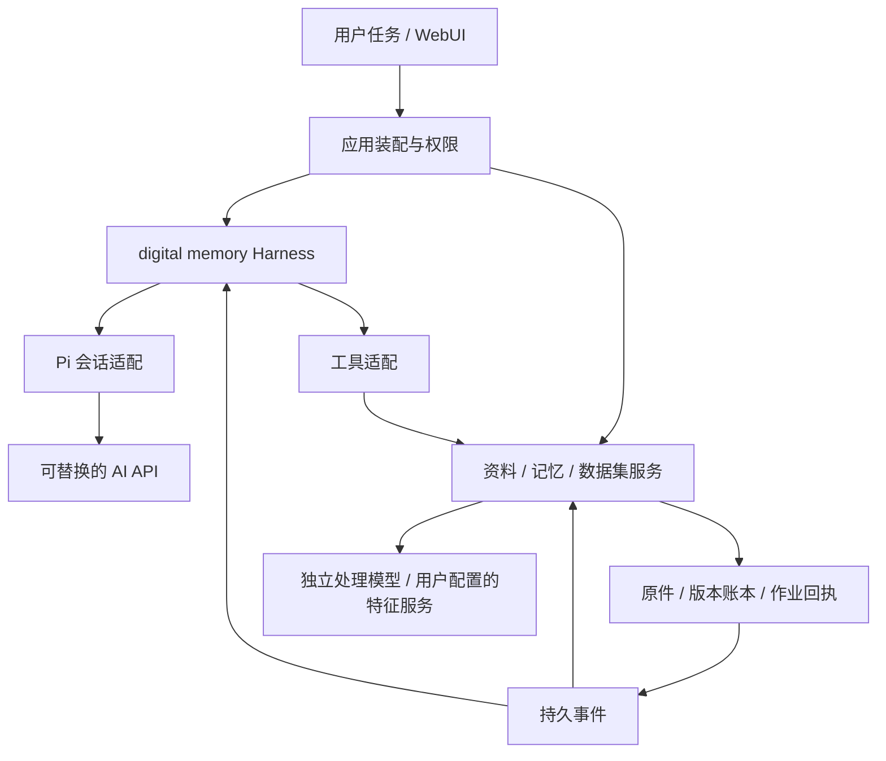

# 架构

[产品定义](product.md)描述用户任务；本文描述当前模块、数据与执行边界。阶段进度和实测结果见[文档索引](README.md)，模型服务配置与协议单独维护。

## 系统组成

digital memory Agent = 可替换的 AI + 自定义 Harness。Pi 提供模型会话与工具循环；Harness 组织任务、上下文、能力、执行状态和交付。资料处理、记忆维护、检索和数据集由独立业务服务完成，Agent 与直接操作页面调用同一服务。个人参数记忆是另一个需要真实训练和独立评估的产物。

| 模块 | 职责 |
| --- | --- |
| `apps/web/src/` | Next.js 工作台、官方 shadcn/ui 与 AI Elements、真实事件展示 |
| `apps/agent/src/harness/` | 产品任务、上下文策略、能力注册、运行协议与作业续接 |
| `apps/agent/src/integrations/pi/` | Pi 会话、模型调用、事件投影、资源和工具操作适配 |
| `apps/agent/src/application/` | 服务装配、PiHost、工具工厂、HTTP 与能力状态 |
| `apps/agent/src/memory/` | 资料处理、记忆账本、检索、人物与活动、数据集 |
| `apps/agent/src/storage/` | 版本记录、事务与持久事件回执 |
| `packages/contracts/src/` | 前后端共享类型与执行事件归约器 |
| `services/memory-worker/` | 可选旧版 CPU 特征适配与评测基线，显式配置才启用 |

`AgentRuntime` 提供通用执行接口，Pi runtime 通过 `PiHost` 使用业务能力，不直接持有记忆库。`Store` 装配 `MemoryRecords`、`WorkspaceStore` 等存储模块；旧入口保留转发兼容，新代码按所属模块导入。

## 前端工作台

工作台采用 neutral 黑白主题，默认深色。主导航为对话、记忆、资料库，设置与更多工作提供其他入口。会话居中；文件、成果、证据、终端和训练交付按需打开工作区。桌面 Resizable 面板稳定挂载，窄于 1100px 使用 Sheet；标签和编辑状态由工作区管理。

Agent 运行界面组合 AI Elements Message、Reasoning、Tool、Confirmation、PromptInput、Queue、Task、Sources、Attachments、Terminal 和 Context。`toolUI` 将真实 Harness 状态映射为组件状态。供应商没有返回的思考内容不会补造；工具输入、结果、失败和审批随会话保存。

正文默认流式：MessageResponse/Streamdown 使用 150ms 增量淡入，结束后移除动画包装。文字和工具参数增量按 50ms 合并，工具开始、结束与审批及时展示。思考、工具详情默认收起，用户展开和页签选择保持，结束不自动折叠；工具失败在收起时仍有摘要。

Conversation 继续使用官方 `use-stick-to-bottom`。展开、收起及切换详情页签前调用 `stopScroll` 暂停贴底，保留阅读位置；用户可回到底部继续跟随。工具 CodeBlock 等按需加载使用局部 Skeleton，避免上层消息挂起导致会话高度突变。历史分页与 SSE 重连共用真实消息标识。

顶层页面通过 React Activity 保留已访问视图和本地草稿、筛选、未保存输入，隐藏时暂停 effects。常用页面代码在空闲时间依次预加载，数据访问时读取；导航使用 transition 与共享 Suspense，先反馈选择，保留当前内容直到新页面就绪。整页不重复淡入。会话控制保持挂载，已完成审批与自动记录复用状态，运行中和主动操作照常刷新。

会话工具栏提供 compact、会话树、工具与扩展入口。输入支持文件引用、命令、执行中调整和排队补充；已加载 Skill/模板可带入输入框。工作区打开指定对象与恢复上次标签是不同操作，普通执行事件不抢占查看焦点。来源与适配说明见[第三方说明](../THIRD_PARTY_NOTICES.md)，最终交互实测见[0039](plans/0039-agent-interaction-and-tool-loading.md)。

浏览器经同源 `/api` 调用 Fastify，Next Route Handler 保留流式、Range 和 Last-Event-ID。模型、特征服务、Exa 和 MCP 密钥由服务端保存，不回显已保存值，也不在浏览器持久化。

## Harness 与 Pi 会话

执行闭环为：用户目标 → 当前上下文 → AI 选择工具 → Harness 按权限执行 → 返回真实结果 → AI 继续或交付。确定性的分段、索引、批处理与恢复交给业务程序；模型负责理解、选择、组合与判断结果。

使用 Pi 1.0.0 的公开 SDK：AgentSession、SessionManager、ResourceLoader、扩展 hooks、operations 和 ModelRuntime。SessionManager JSONL 是模型上下文的权威来源；SQLite 保存任务、Run、事件、审批和业务状态。`PiTranscript` 把原生消息和工具事件投影为稳定标识的 UI 内容，前后端复用 `@memory/contracts/execution`。

后端执行独立于浏览器和 SSE 连接。时间线分页读取，断线按事件游标重放，浏览器切页不会取消任务。运行状态包括 queued、running、waiting、completed、failed、stopped；停止等待模型和进程实际取消后完成。重启依据检查点与回执续作，已提交业务操作复用结果；文件、脚本或外部工具效果不明时保留恢复选择，避免盲目重复。

`steer()` 在工具轮次边界送入调整，`followUp()` 在当前工作结束后继续，未消费队列可以退回编辑器。另有持久 Run 队列用于独立后续任务。`ask_user` 和审批保存后暂停 Pi，回答或审批到达后继续原调用，不靠模型轮询等待。

压缩、会话树导航和分支使用 Pi 原生能力。压缩摘要保留为会话节点，可指定保留重点；上下文显示采用 Pi 估计与供应商计量。会话树可继续原节点或创建新分支，两者均不回滚项目文件或后台作业。会话持久化和压缩不替代长期个人记忆。

### 工具、Skills 与 MCP

新用户任务默认提供 `read`、`ask_user`、`search_memories`、`search_evidence`、`read_evidence`，加 Pi 原生 `tool_search`。其余内置工具以 deferred 注册，发现后发送完整定义；禁用工具不参与发现。审批恢复、后台完成通知与同任务继续执行保留已发现能力，新用户任务恢复初始集合。

`digitalMemoryProfile` 提供精简产品规则和活动整理、查询、纠正、训练资料四类 Skills。模型按需读取完整流程，用户可覆盖或停用同名资源。Skills 与提示模板通过 ResourceLoader 接入，使用 Pi 原生展开逻辑。工具目录和 `/api/tools` 共享注册来源，能力面板区分配置、实际加载、可用性与验证程度。

显式装配 Pi MCP 和工具搜索扩展。支持带静态请求头认证的 Streamable HTTP，以及本地 stdio；用户选择 direct/deferred。Pi 当前 BM25 只分词英文与标识符，模型用英文能力词或工具名发现。扩展的询问进入持久审批，文字状态与编辑器请求进入 Web 适配。任意 TUI、MCP OAuth、扩展市场和 codemode 尚未适配；不自动执行项目内未知 TypeScript 扩展。

| 能力 | 主要接口 |
| --- | --- |
| 项目与执行 | Pi `read/write/edit/bash`，`list_files/search_files`，`update_plan` |
| 联网 | `web_search`（Exa）、`web_read`（公开静态网页） |
| 资料与证据 | `search_assets/read_asset_text`、`search_evidence/read_evidence` |
| 记忆与纠正 | `propose_memory/search_memories`、`inspect_memories/change_memories`、`manage_memory_links` |
| 活动整理 | `process_assets`、`organize_memories`、`query_memory_activities/change_memory_activities`、`query_events` |
| 后台作业 | `read_job_result/manage_job` |
| 数据集 | `build_dataset/rebuild_dataset`、`audit_dataset`、`inspect_dataset/review_dataset`、`deliver_dataset` |
| 整理成果 | `write_artifact/read_artifact` |

## 模型与特征服务

主 Agent 和文字、照片、视频画面、问题生成、样本核验模型分别配置。`ModelAccess` 共享供应商连接，`MemoryProcessors` 提供独立业务处理端口。支持 OpenAI 兼容 Chat Completions / Responses 与 Anthropic Messages；图片输入需连接和实际模型同时支持。配置存在不代表能力已验证。

文字嵌入、图像嵌入和人脸使用 `FeatureProcessor` 接口，HTTP 与旧 Python 适配分别实现。三个通道默认关闭，可连接同一服务或不同服务，模型、权重与 GPU/CPU 部署由用户选择。文字可用 OpenAI `/embeddings` 或 Memory Features v1；图像与人脸用 Memory Features v1。

服务端探测实际维度，向量存储支持 1–8192 维，按通道与编码器指纹隔离。换模型、版本、地址或编码空间后后台重建，查询只使用当前指纹；不进行跨模型向量匹配。人脸阈值需要按用户模型校准，旧确认保留，新模型候选不自动继承身份。配置、索引与恢复见[特征服务说明](local-memory-processing.md)，字段与适配要求见[接入协议](feature-service-protocol.md)。

## 资料、记忆与后台处理

SQLite 保存原件元信息、MemoryEntry 与版本、人物与事件、活动、索引和作业；原件、会话与导出文件保存在私有数据目录。`personal` 与 `demo` 分开，示例不自动预置，也不自动进入个人检索。MemoryEntry 保留陈述/观察/推断、确认状态、发生与有效时间、来源和修订记录。

### 入库与作业

会话附件先保存原件，发送目标后由 Agent 选择处理；资料库直接上传按启用策略后台处理。`AssetProcessingService` 提交持久作业，缺配置保留待配置。旧资料不因升级自动外发或重新提取。自动整理和索引维护无需主 Agent 在线。

业务变更与 `domain_events` 在同一事务提交。消费者保存送达回执、重试与检查点，至少一次投递按来源、版本和请求键去重。`TaskJobs` 关联运行、工具和作业；长任务先返回 `jobId`，完成事件继续所属任务，等待期间不调用模型轮询。停止任务取消其所属作业，独立资料库作业继续。

`/api/jobs` 汇总导入、活动、数据集、核验、索引与自动记录作业。各领域服务持有自己的队列，提供共同的状态、分页结果、取消与重试接口。处理完成不等于观察或模型判断正确。

### 检索与原件

`MemoryQueryService` 组合 SQLite FTS5、用户配置的文字向量和图像通道，按排名融合并读取当前账本。空间、来源、版本、停用、人物与时间限制先于候选截断生效；未配置特征服务时可用关键词检索。完整列表、计数用 `MemoryCatalog` 或结构化分页，数据集遍历完整范围，不用检索 Top-K 代替全量。

`EvidenceService` 独立检索原始文字、图片、视频帧和当前观察，区分 raw-source、unverified、confirmed。`search_memories` 只取符合确认规则的事实。`read_evidence` 核验原件版本，文字按 UTF-8 分页；图片支持 EXIF 正向坐标下的局部裁剪，缩放后返回真实像素和视图摘要。`SourceRef` 保存原件、范围与版本；已读取来源只证明读取行为，不证明解释正确。

视频通过 FFprobe/FFmpeg 解码抽样画面，保存请求与实际时间。`AssetIndexService` 独立建立视频帧的图像向量和人物出现，`video_index_plans/video_index_frames` 保存策略、状态与回执；成功帧可复用，失败帧可重试。`frame:` 命中读取固定画面，`asset:` 可选择其他时间。默认每 10 秒抽样、最多 120 帧；自动视频处理默认关闭，音频转写未实现。抽样不能保证覆盖短暂事件。

### 活动、人物与纠正

`MemoryGraph` 保留来源观察、实体、人物候选、事件和关联历史。人脸相似建立候选，真实身份需要依据；同名不自动合并，新出现不继承整组确认。已确认画像和相关记忆以有界上下文供后续任务使用，原始引句和旧值保留在账本，不覆盖当前纠正。

活动整理用观察、来源和用户本轮说明组织一次具体经历。作业保存原话、已送达补充、回答、参考时间与时区；明确的日期和归属可用于本批资料。`targetActivityId` 将新资料追加到原活动，保留 ID、正文和确认状态。确认活动不批量确认底层观察或人物身份。

明确的确认、纠正、停用通过共用业务命令保存真实指令及前后版本。活动派生记忆的修订同步活动；来源与记忆变化触发索引维护、活动更新、训练样本失效，并使运行中的旧上下文失效。手动合并、拆分与排除决定保留，不被下一次自动整理撤销。新会话回忆使用当前活动与来源，日常流程实测见[0037](plans/0037-daily-memory-and-pi-controls.md)。

## 训练数据与个人模型

`DatasetService` 冻结合格记忆、来源与关联版本，后台生成、核验和导出。未确认观察、推断、未解决冲突和不可核验来源不进入训练真值。模型生成题先待核对；训练和评测针对同一已知事实使用不同问法，不能把这种划分当作未知事实测试。

`DatasetAudits` 先仅凭冻结来源和问题作答，再核对候选答案与训练评测配对。原文编号用于取回实际引句；修订题干后重新作答。`inspect_dataset/review_dataset` 支持分页检查、批准、修订、排除和留待核对，保存主体与逐题依据。模型核验仍有语义错误，实测及限制见[0031](plans/0031-dataset-answerability.md)。

导出文件为 `training.jsonl`、`review.jsonl`、`manifest.json`，模型生成任务另有 `evaluation.jsonl`。待核对题退出训练与评测；剩余题已明确处理时可部分交付，同时保留原核验失败和后续决定。`deliver_dataset` 检查当前版本与实际文件，工作区提供下载。

记忆纠正使相关数据集过期，`DatasetRebuilds` 按原范围重建并复用未变化且仍有效的样本决定。训练题修订会更新关联评测状态。模型版本依赖可标记受影响，但权重不会随数据库修改自动更新。个人模型训练、权重交付和独立闭卷效果尚未实现，训练仍暂停。

## 执行、部署与恢复

项目目录由用户显式打开，读写与文件检查点绑定项目范围。Pi 文件/Shell 工具通过 operations 接入，权限在实际操作中实施。脚本使用 Linux / WSL2 的 bubblewrap，仅项目可写，不继承服务端密钥；本地 MCP 的项目挂载只读。终端与本地 MCP 网络需显式启用。沙箱不可用时执行失败，不降级到宿主机。

文件检查点保存运行前后差异，恢复前检查后续修改。项目文件、资料库原件和会话上下文分别管理：分支不回滚文件，删除会话不删除项目和独立记忆，缩小下一轮资料范围也不会抹去已有模型历史。

当前是单用户本机应用，默认监听回环地址，检查 Host/Origin；未提供公网身份认证、多租户与静态数据加密。模型和 Harness 私密配置写入权限为 0600 的文件。密钥、原件、数据库、会话、运行日志、构建和权重均不进入 Git。

记忆备份包括 SQLite、原件、已完成数据集与 Pi 会话；先停服，再备份或恢复到新目录。模型密钥、Harness 配置、编码器缓存、项目文件和权重另行备份。命令及恢复范围见[数据集与恢复](local-memory-processing.md#数据集与恢复)。

针对变更验证实际行为。浏览器和集成检查使用真实 Pi、SQLite、HTTP/SSE 等链路与模型协议替身；真实模型和质量对照单独记录，不把流程通过当成识别或训练效果通过。启动与开发命令见[项目 README](../README.md)。

## 上游参考

- [Pi SDK](https://github.com/earendil-works/pi/blob/main/packages/coding-agent/docs/sdk.md)、[MCP](https://github.com/earendil-works/pi/blob/main/packages/coding-agent/docs/mcp.md)、[工具暴露](https://github.com/earendil-works/pi/blob/main/packages/coding-agent/docs/extensions.md#tool-exposure)
- [AI Elements](https://elements.ai-sdk.dev/docs)、[shadcn/ui](https://ui.shadcn.com/docs)
