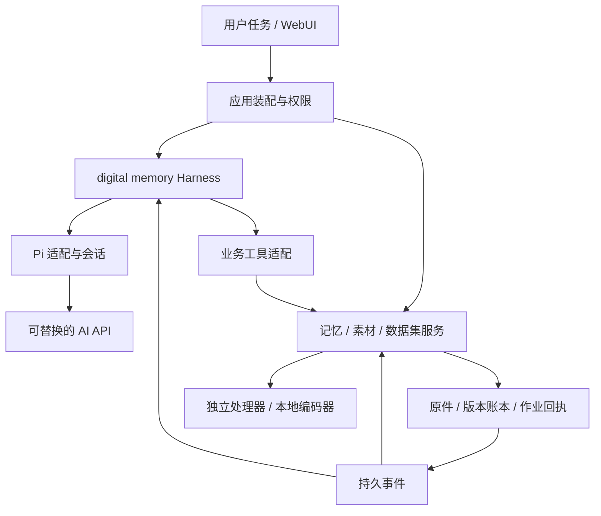

# 架构

产品目标和验收任务以 [product.md](product.md) 为准；当前实现、运行与下一步见[收工交接](plans/2026-10-05-handoff.md)，逐项实测记录在[阶段索引](README.md#历史实现与验证)。本文描述职责、数据与执行边界。

## 系统边界

digital memory Agent = AI + 自定义 Harness。Pi 提供可复用的模型会话与工具循环；本项目定义个人资料组织、证据利用、记忆维护、训练数据准备所需的任务、上下文、能力、执行状态和交付。原始资料、长期记忆和业务进度属于本项目，个人参数记忆是独立的未来训练产物。

采用 Agent first：媒体与目标进入会话，Agent 选择业务能力、跟进结果、核对并交付训练文件。后台维护和批处理自行恢复，手动页面共用同一业务命令。确认的偏好与纠正进入后续任务的有界依据，使特化 Agent 随持续使用适应用户。

WebUI 使用 Next.js、官方 shadcn/ui 与 AI Elements，采用 neutral 主题、默认深色与 Geist 字体。主导航为对话、记忆和资料库，数据集及维护入口位于管理菜单。新对话默认使用居中输入和阅读区，点击文件、成果或来源才展开工作区；小于 1280px 时同一工作区使用全宽 Sheet。宽屏使用可调整的分栏，并可展开查看器。工作区组合 shadcn Tabs，保留文件、改动、终端、成果、证据、活动及训练文件标签；访问过的页面保持挂载，切换时保留编辑内容。每会话保留至多 12 个标签的浏览器偏好；URL 的 `workspace=1` 恢复显式打开的工作区，重新打开按需读取当前业务状态。记忆页默认展示活动，既有记录、人物和时间线在「记忆记录」中。

Agent 运行界面统一组合 AI Elements，`toolUI` 将 Harness 的执行状态映射为 Tool 组件状态，参数与结果使用 ToolInput/ToolOutput。Confirmation 显示待审批、接受、拒绝和已回答记录；PromptInput 处理主输入及补充回答，Queue/Task 承载队列与分段进度。当前和恢复的历史消息共用 Message/Reasoning，业务状态仍由 Pi 与服务端持久化负责。代码高亮在展开详情后按需加载，纯文本和大文件直接走 CodeBlock 文本路径。

侧栏平铺最近会话，工作目录进入附件与工作区菜单；全部对话列表跨目录展示任务与成果，命令菜单提供真实操作与有界搜索。输入框以 Popover + Command 完成文件引用和命令补全，保留焦点与光标；菜单结束动画不把焦点从已开始输入的文本框取走。项目文件索引按需读取、短时缓存。工作区区分打开指定对象和恢复上次标签，普通执行事件不抢占查看焦点。文件“已查看”标记按运行、路径和前后哈希保存在浏览器，不代表 Agent 已验证内容。布局依据见[会话居中的工作台](design/0003-conversation-centered-workbench.md)。

浏览器通过同源 `/api` 调用 Fastify。Next Route Handler 流式转发 GET、POST、PUT、PATCH、DELETE、HEAD，保留来源、Host、Range 和 Last-Event-ID。模型和 Exa 密钥、MCP 认证信息只在服务端保存，不回显已保存值，也不进入浏览器持久化。

Pi SDK 1.0.0 是模型会话与工具循环的执行内核；使用用户指定的 badlogic/pi-mono 项目现上游 earendil-works/pi。我们的 harness 负责项目隔离、权限、持久任务、Web 交互、文件检查点和业务能力接入。不同职责通过 `AgentRuntime`、资源适配、工具操作适配与共享类型衔接，不把聊天组件本身当作 Agent。

## 模块与依赖

| 目录 / 模块 | 负责内容 | 依赖边界 |
| --- | --- | --- |
| `apps/agent/src/harness/` | 运行协议、产品任务定义、能力注册、上下文策略接口、作业关联与续接 | 通过端口调用 Pi、业务服务；不实现识图和分段处理 |
| `apps/agent/src/integrations/pi/` | AgentSession、SessionManager、模型传输、事件和结构化处理器适配 | Runtime 只接收 `PiHost`，不持有记忆库或 Store |
| `apps/agent/src/memory/` | 记忆账本、素材处理、检索、原件索引、人物/事件、数据集 | 使用 `MemoryData` 与处理器端口，不创建 Agent 会话 |
| `apps/agent/src/application/` | PiHost、任务上下文、业务工具、资源、HTTP 与能力状态装配 | 将同一业务服务提供给工具和 WebUI |
| `apps/agent/src/storage/` | 通用版本记录、事务与持久事件回执 | 不依赖 Pi 或产品界面 |
| `services/memory-worker/` | 本地文字、图像、人脸特征计算 | 固定协议、模型指纹与进程边界；无供应商密钥 |
| `apps/web/src/` | 任务交互与业务页面、真实事件映射 | 官方组件组合，业务规则在服务端实施 |
| `packages/contracts/src/` | 按模型、素材、工作台、Harness、记忆、证据和数据集分组的共享类型 | 原入口继续导出，旧客户端与脚本导入保持兼容 |

`Store` 是应用装配入口；`MemoryRecords` 管记忆和版本，`WorkspaceStore` 管任务、执行记录与成果。旧记忆方法和原根目录模块保留转发适配，现有数据标识与 API 不迁移成另一份真源。它们属于兼容入口，新代码应从所属目录导入。

## Harness 的职责与工具边界

目标是让 Agent 完成 [M1–M5](product.md#核心任务) 所定义的个人记忆任务，同时保留通用执行能力 H1。AI 根据目标和实际结果决定下一步；Harness 提供上下文、工具、执行环境、状态与反馈。Agent 不承担长期记忆存储与维护。业务服务独立完成检索、素材处理、记忆维护和数据集构建，经适配层供 Agent 和界面调用。

| 模块 | 程序负责保证 | AI 负责判断 |
| --- | --- | --- |
| 会话与模型适配 | 复用 Pi 的模型调用、工具循环、流式事件和会话生命周期；适配可替换供应商 | 理解请求、制定或调整任务步骤 |
| 工具执行 | 注册类型化接口；验证参数、权限和数据范围；执行调用并返回真实结果 | 选择能力、提供有意义的业务参数、组合结果 |
| 上下文管理 | 装载当前目标、相关工作状态和有界证据；大结果保留引用；标记旧版本失效 | 判断缺少什么信息，按需检索或进一步读取 |
| 任务与后台作业 | 持久化任务、工具调用、作业关联和状态事件；处理等待、取消、恢复与资源限额 | 根据完成结果或异常决定是否继续用户任务 |
| 执行环境 | 提供项目文件、沙箱、网络和扩展能力，强制实施配置的边界 | 为开放性任务选用现有工具、脚本或 Skills |
| 交付与核验 | 保存产物和可检查的执行依据；区分受理、执行成功、部分完成和失败 | 对照用户目标审阅结果、处理语义问题并说明缺口 |

运行闭环为“接收目标 → 构造当前上下文 → AI 选择行动 → Harness 校验并执行 → 返回真实结果 → AI 继续或交付”。任务步骤由模型根据结果调整；业务工具内部已经确定的流程由程序执行。普通授权范围内的操作持续推进，只有必要信息缺失或超出既定授权时才需要用户介入。模型输出完成文字不应把尚未完成的关联作业标成成功。

工具适配层只负责将 Pi 调用转换为业务请求、注入可信范围和记录执行；HTTP 接口、WebUI 操作与测试应复用同一业务服务。检索策略、索引选择、排序融合、版本过滤、去重及训练样本核验由服务实现，避免散落在提示词、Pi 工具函数和前端中。工具以用户能理解的能力为粒度，例如查找记忆、处理一批资料、构建数据集；不要求 Agent 逐张驱动预处理或逐页指挥索引更新。

较短的工具调用直接返回结果；耗时任务先持久化作业并返回 `jobId`、受理状态与结果引用。Harness 订阅进度和完成事件，关联到发起任务及 WebUI；等待期间不消耗模型轮次轮询进度。完成事件只有在所属任务仍允许继续时才触发后续模型调用，并须去重。停止前台任务时，根据明确的作业归属规则取消其作业或保留独立后台作业，不能由模型臆测是否仍在运行。

作业执行器管理分批、幂等回执、重试与检查点，重启后先核对已提交结果。可恢复的业务作业按回执续作；副作用结果不明的通用操作保留中断状态，不盲目重放。新增素材、记忆纠正与来源停用产生的维护任务由服务端事件触发，索引和后续样本失效不依赖用户再次打开对话。

业务服务内部可以按需调用视觉、嵌入或其他专用模型，但这些是处理器调用，不要求启动主 Agent 会话。模型连接可共用底层适配和配置，提取器不应成为通用 `AgentRuntime` 必须实现的业务方法。独立开发首先指模块、接口和测试边界清楚，当前可以仍在同一个后端进程内运行。

当前 `AgentRuntime` 只保留通用运行接口；`ModelAccess` 提供共享的供应商连接，`MemoryProcessors` 提供独立文字/视觉提取。`MemoryQueryService` 负责召回、冲突与有界证据，工具和上下文装配调用同一服务。`AssetProcessingService` 将指定资料交给持久导入 worker，Pi 通过业务工具工厂接入这些能力。`MemoryFeatureService` 调度独立本地特征 worker，`MemoryEvents` 负责完整事件查询，`DatasetService` 独立冻结、核验和导出训练资料。

`TaskJobs` 保存运行、工具调用与作业的关联。`process_assets`、`organize_memories` 与 `build_dataset` 返回受理回执；`read_job_result` 按范围读取当前结果；`manage_job` 处理取消和重试。作业事件更新 Run 和 WebUI，所有关联作业终止后才向 Pi 发送一次自定义完成消息并继续任务。等待期间不调用模型轮询。每个运行最多关联八个作业，处理工具单次最多 200 份资料、512 个片段；结果有分页与字节限制。候选仍是待核对观察，受理或处理完成不等于结论准确。

只发附件时，`Run.text` 保留空字符串，服务端另存整理目标 `Run.goal`；默认目标不进入本人陈述提取。多个附件逐份上传、保留失败项并支持单独重试。混合处理保存所有原件 ID、重复副本、每种媒体的实际模型和逐份覆盖；损坏文件或某一处理模型未配置不阻断其他可处理资料。`read_job_result` 可分别分页读取素材覆盖与观察，不能把返回的首批观察当作全部。任务内对同一作业最多重试一次，只重试所选未完成部分；明确管理共享库作业仍保留其库归属。

重启可以恢复已持久化的作业等待。完成通知在继续模型前认领并保存到 Run，之后中断由恢复流程对账，复用通知和业务回执；不重新提交作业。每条作业关联显式保存 `task` 或 `library` 归属：停止任务只取消它拥有的作业，共享资料库作业继续，任务不再因其结果自动续接；处理中心仍可明确取消库作业。旧关联默认 `task`，保留旧取消语义。关联作业失败时，前台运行不能仅凭模型结束文本显示成功。

### 持久事件与自动入库

业务数据和 `domain_events` 在同一 SQLite 事务提交。消费者以 `(consumer, eventSeq)` 保存送达、尝试次数与重试时间，失败不会冒充送达。投递为至少一次，处理器通过来源、版本与请求键去重；不声称数据库之外的模型请求恰好执行一次。重建派生索引保持作业修订号递增，不能复用旧完成事件的身份。

新增原件发布 `asset.added`。`AutomaticIntake` 保存来源摘要和策略版本，按启用的文字/照片/视频策略提交独立资料库作业；缺配置保持待配置，恢复连接后重试。`AssetIndexService` 独立建立文字分段、FTS、图像/人物索引，原图不依赖提取出的 MemoryEntry 或人工确认。会话附件和手动导入窗口使用 `processing=requested`：前者等待发送后的 Agent 决策，后者由显式导入提交负责提取。原件索引照常建立，资料库直接上传继续服从自动策略。

升级只为旧资料建立本地索引，不补造自动外发事件。关闭自动整理后，新资料保留为原件，用户可显式处理；已提交作业可在处理中心单独取消。新策略不会使已停止使用的来源重新可用。素材、记忆、模型指纹和配置变更通过持久事件触发维护，后台不需要主 Agent 会话。

`/api/jobs` 聚合导入、活动整理、数据集及核验、入库等待、原件索引、消息记录、记忆特征作业；结果标明 `coverage: recent`，不是全库历史统计。列表、详情、分页结果、取消和重试共享驱动接口，领域服务继续拥有各自队列。完成、失败、取消、跳过和等待配置分别展示；浏览器轮询只刷新视图，不调用模型。

### 能力、资源与模型策略

`CapabilityRegistry` 统一应用工具工厂及目录，运行时与 `/api/tools` 使用同一注册来源；Pi 原生 MCP 与 `tool_search` 的实际注册情况仍来自 Pi 会话。`/api/capabilities` 分别报告实现、配置、可用性和验证程度，不从工具名称推断效果。

`digitalMemoryProfile` 定义产品指令和四类任务资源，经 `ResourceLoader` 装配为真实 Skills 与提示模板；用户可用同名同类资源覆盖或停用。上下文规则、任务作业策略、权限、服务适配和交付记录共同构成自定义 Harness，产品规则不只写在提示词中。

当前任务上下文按目标选择活动整理、素材证据、纠正或数据集规则，按需读取对应 Skill；普通会话不预装全部训练资料流程。计划步骤有稳定 ID，可关联真实作业、成果、已读取记录或命令结果；工具开始时绑定正在执行的步骤。用户补充回答保留独立 ID，后续询问不会覆盖早先作为纠正依据的回答。

任务模型由每轮输入选择；文字处理（包括后台陈述记录）、照片处理、数据集问题生成分别有配置。底层均可复用 `ModelAccess`，业务处理使用 `MemoryProcessors` 端口。显式模型配置失效时报告不可用，未指定才使用对应兼容回退；嵌入模型由独立本地配置管理。更换编码器需满足通道维度与指纹契约；当前没有动态载入任意维度模型的界面。

自动入库与 `process_assets` 混合批次分别使用配置的文字、照片模型，分块持久保存实际模型及思考强度；主 Agent 模型不要求与处理模型相同。显式文字/照片导入使用用户当次选择。配置修复后，重试可以重新准备之前失败的原件并正确切分长文字，已完成部分保持复用。

## 项目、执行与权限

项目保存规范化的真实工作目录。用户可通过 WebUI 打开 Agent 主机上已有的文件夹，文件保留在原位置；默认项目位于 `.data/workspace`，应用创建的空白项目位于 `.data/projects/<id>/workspace`。旧项目记录迁移时补齐目录信息。相同真实路径复用同一项目，不改变已有会话的目录关联；目录丢失、移动或被替换为符号链接时拒绝执行，不重新创建目录。

目录选择通过同源、受 Host/Origin 检查的主机目录浏览 API 完成，支持上级目录、常用位置、隐藏目录、名称筛选和分页；不将浏览器文件上传当作主机路径。WSL 可解析已挂载盘符路径与当前发行版的 UNC 路径。文件可以通过 WebUI 导入、创建、编辑和下载。项目指令通过设置管理；创建 Pi 会话时也会加载项目根目录内的 `AGENTS.md`，不向上读取宿主机指令文件。

Pi 原生 `read`、`write`、`edit`、`bash` 工具保留上游参数和执行语义，文件与 Shell 操作通过 SDK 提供的 operations 接口适配。读写检查项目边界并拒绝符号链接；`bash` 在 Linux / WSL2 的 bubblewrap 中执行，只有当前项目可写，系统运行库只读。进程环境重建，不继承服务端密钥。停止和超时会终止进程组，终端输出通过原生工具更新事件保留。Pi 生成的截断日志复制到项目可读目录；单次记录最多 1 MB，更大输出应重定向到项目文件。

打开目录时拒绝系统目录、文件系统根目录和应用私人数据目录。项目可以包含应用仓库，但文件工具、列举、搜索、快照和恢复会排除应用的数据目录与 `.env`；终端和本地 MCP 对这些路径额外挂载只读空目录或空文件，避免将服务端数据暴露给模型工具。

默认 Shell 不联网。前端的「允许终端与本地 MCP 访问主机网络」是单独的显式配置；启用后共享主机网络，能够接触网络和本机服务，不应把这种模式描述为网络隔离。文件系统挂载仍受限制。联网搜索和网页阅读由服务端专门的工具完成，不要求开启 Shell 网络。

权限分为只读、操作前询问、项目内自动执行。项目有默认值，每次运行可以由用户选择。Pi `tool_call` 扩展在执行前实施权限和工具开关；未经允许的写入、Shell 和 MCP 调用会被阻止。询问模式将审批写入数据库，等待 WebUI 决定，拒绝也保留记录。模型不能通过提示词改变权限。上传的脚本不会自动运行，只有实际工具调用才执行。

每次运行开始前保存文件检查点，结束后比较内容哈希，展示新增、修改、删除及前后内容。恢复逐文件检查当前哈希，拒绝覆盖后续编辑。分支只复制模型上下文，不回滚共享项目文件。当前工具读写和上传单个项目文件最多 10 MB，Web 编辑正文最多 512 K 字符且受 1 MB 请求体限制；检查点最多 5,000 个条目、64 MB 文件内容，预览正文最多 512 KB。依赖、缓存、`.git` 和 harness 生成的资源目录不进入检查点；超过限额会明确报错。资料库原件上传使用独立的大小限制。

`RunInput.fileReferences` 保存最多 20 条 `{ path, runId? }` 项目文件引用，与资料库 `assetIds` 独立。入队及执行前校验项目范围、应用私人路径和符号链接；历史引用必须来自同一项目真实运行中的改动记录。当前文件按执行时的内容读取，单文件最多 12,000 字节；历史前后版本使用已保存的内容，各最多 12,000 字符。引用正文共用 48,000 的片段预算（当前文件按字节、历史文本按字符扣减），标明截断、二进制、当前或历史版本，通过 Pi 隐藏的任务上下文进入模型。历史删除文件也能引用；磁盘上的后续修改不会替代已选历史版本。

审阅意见先追加到现有草稿，连同来源运行及文件引用一起发送；包含文件引用的执行中输入使用持久化 Run 队列，避免原生纯文本 steering 丢失上下文。工作台本地命令不会消耗已选文件，实际发送成功只清除已发送引用与未被继续编辑的文本；重试旧运行不会清空用户另写的草稿。

相同或互相包含的工作目录一次只允许一个会话执行，避免脚本和人工编辑交错破坏检查点。同一会话可以持久化排队。目录互不重叠的项目可以独立执行；更改会重建运行时的连接和资源配置须等待活跃执行结束。

## Pi 会话与生命周期

- SessionManager 的 JSONL 是模型上下文的权威来源，包括用户输入、模型输出、工具、压缩和会话树节点。
- SQLite 保存项目、会话关联、Run、RunEvent、审批、资料、结果和记忆。Run 更新与事件写入位于同一事务。
- `PiTranscript` 将原生事件投影为消息、内容块、工具及轮次标识，`message-end` 用最终消息修正缺失的增量，保留已产生的工具结果。Pi 在公开 `message_end` 后才追加 JSONL，适配器在下一个事件或结束时关联实际 entry ID。前后端共用 `@memory/contracts/execution` 归约器；类型入口保持纯类型导出，运行代码走独立 TypeScript 子路径以兼容 Node 24 和 Next。旧记录按已保存顺序展示，不补造消息边界。
- `/conversations/:id/timeline` 默认返回最近 50 组消息，游标绑定所属会话和真实消息位置，可跨 Run 翻页；原生分支外的消息不进入当前视图。前端按服务端顺序合并，加载旧页保持滚动位置，会话缓存至多 12 份。SSE 游标与历史页游标独立，断线重放不依赖 UI 拼接推测消息边界。
- 后端 worker 独立于 SSE 连接运行。关闭浏览器、切换页面或断线不会取消任务；事件游标支持刷新与重放。
- 状态包括 queued、running、waiting、completed、failed、stopped。成功完成须等文件变更扫描结束，不能在交付记录尚未保存时提前标为完成。
- 原生 `steer()` 在当前工具轮次边界送入补充要求；`followUp()` 在当前工作结束后继续同一次运行。区分 queued、扩展 handled、实际送达与退回，`clearQueue()` 清空尚未消费的原生队列并退回编辑器，不把清空误判为送达。当前不提供上游没有的逐项队列编辑 API。另有应用自己的持久化 Run 队列，用于独立的后续任务。
- 停止先保存 `stopRequestedAt`，等 Pi 与进程取消完成后再标为 stopped，期间最后到达的工具结果仍保留。取消模型、工具和归属该运行的作业，保留已提交文件，明确停止的任务不自动启动。进程重启按持久检查点和回执分类：可对账的继续同一 Run，待回答和待审批保留等待，效果不明的工具进入恢复核对，旧记录无检查点或多次中断须人工继续。未送达输入保留。
- 分支通过独立的 SessionManager 创建指定节点的分支文件，再关联新会话；原会话保留。历史浏览、会话导出和模型上下文不通过拼接 UI 消息伪造。
- 会话树保留工具结果、压缩和可显示自定义节点；隐藏 Harness 上下文节点时重新关联可见父节点。原会话内继续使用 Pi `navigateTree`，返回待编辑用户文本与当前路径；新建分支是独立操作。二者均不回滚文件或后台作业。
- 手动与自动压缩使用 Pi；压缩和重试状态、供应商公开返回的思考内容、工具中间输出、父工具 ID 和计量进入运行事件。不会生成模型没有返回的推理文本。
- 上下文显示采用 Pi 的估计和供应商返回计量，压缩后未知值显示为空；不冒充逐 token 精确计数，也不显示未核验价格。
- 关闭或重建运行时先发送扩展 shutdown 事件，关闭 MCP 连接，再释放会话。

`Run.checkpoint` 保存 Pi 会话节点及执行配置摘要（项目目录、指令、权限、工具开关、模型 ID、资料范围、Skills/MCP）；相关配置变化需核对后继续。记忆命令、成果写入及作业关联在业务事务内保存工具回执。恢复先修补 JSONL 中缺失的结果，再按真实状态继续；文件、脚本与外部 MCP 没有提交回执且效果不明时不能自动重复。选择跳过会在这次恢复中禁用对应工具，选择重试仍经过当前权限。

`ask_user` 与审批持久化后暂停 Pi，等待不占用轮询中的工具栈。审批绑定原始 toolCallId，未消费的已接受审批通过官方 `@earendil-works/pi-agent-core.runToolCall` 执行原调用和 hooks。调用结果保存为自定义会话条目，context/history 投影覆盖先前的等待结果，原始 JSONL 不改写。已消费审批后中断须按效果不明处理；扩展内部的等待也不能把未决请求当成拒绝或已完成。恢复轮次仍由 Pi 执行。

## Skills、模板与 MCP

Skills 和提示模板由前端管理，正文保存在私有配置中，启用的资源写入项目内的受管目录。通过 ResourceLoader 提供真实资源，`/skill:name` 和 `/name` 使用 Pi 的展开逻辑。支持项目指令、`/files`、`/review`、`/terminal`、`/compact`、`/fork` 和 `/settings` 等 Web 命令；压缩和分支只在已有且空闲的任务中提供。不会自动执行导入项目中的未知 TypeScript 扩展。

SDK 显式安装 Pi 的 MCP 与 `tool_search` 扩展，并绑定 Web UI 适配。支持 Streamable HTTP 的字面值请求头认证，以及本地 stdio MCP；本地 MCP 的项目挂载只读，文件修改仍使用原生文件工具。每连接可选 direct 或 deferred 暴露，后者经 Pi 原生 `tool_search` 发现和激活，走同一权限管线。会话能力状态来自实际工具、资源和连接，不从配置存在推断已加载。

扩展的 select/confirm/input/editor 请求进入持久审批，prefill 与 placeholder 分开保存。超时和取消保存明确处置，恢复时相同请求读取原答案。状态、文字 Widget、标题和编辑器请求保存在会话展示记录，经运行事件更新；已有输入时提供合并选择，服务端不让迟到的草稿覆盖新的扩展预填请求。Pi 绑定 UI 时需要可读取的 Theme，适配器提供终端默认颜色的纯文本格式器，Web 外观仍由官方中性色令牌决定。

自定义只使用当前安装的 Pi 1.0.0 公开 SDK：`AgentSession`、`SessionManager`、资源加载器、扩展 hooks、operations 和 `ModelRuntime`。SDK 创建会话并不会自动装配 CLI 的全部扩展；资源与 Web RPC 绑定由本项目显式完成。上游临时或尚未导出的 Harness 接口不是当前依赖。扩展宿主并非沙箱，权限仍须由文件操作与进程边界实施。

本次不提供 Pi CLI 的全部终端交互：任意 TUI 自定义组件、终端主题、MCP OAuth 登录、扩展包市场、codemode 和云端部署不在当前 Web 适配范围内。HTTP 静态认证和本地 stdio 已实际验证，不能将配置表单存在等同于所有服务均可连接。

## 通用与业务工具

| 工具                             | 职责                                                                     |
| -------------------------------- | ------------------------------------------------------------------------ |
| read / write / edit              | Pi 原生项目文件读取、写入、精确编辑                                      |
| bash                             | 隔离执行 Shell，输出、退出状态、超时和取消                               |
| list_files / search_files        | 有界文件树和文本搜索                                                     |
| web_search                       | Exa 搜索，返回真实标题、URL 和正文摘录                                   |
| web_read                         | 读取公开静态网页，限制体积与重定向；DNS 检查并固定请求地址，拒绝私有地址 |
| update_plan                      | 保存执行步骤与状态                                                       |
| search_assets / read_asset_text  | 查询资料，核验并分页读 UTF-8 原件，登记范围及关联的当前确认版本             |
| search_evidence / read_evidence  | 查找原件及待核对观察，按版本读取有界文字或图片，明确证据权威性           |
| write_artifact / read_artifact   | 创建、修订和读取 Markdown 整理结果                                       |
| propose_memory / search_memories | 提出有依据的草稿，检索最新已确认个人记忆                                 |
| inspect_memories / change_memories | 分页检查当前记录，按真实指令执行版本化确认、纠正、停用和冲突解决         |
| manage_memory_links               | 根据明确依据关联身份、合并或拆分人物候选与事件                           |
| process_assets                   | 向独立处理服务提交已授权的资料批次，返回持久作业引用                     |
| organize_memories                | 独立整理生活活动，补齐观察并关联已授权的跨批次资料                       |
| query_memory_activities          | 分页查询活动候选及其当前成员版本、来源和疑点                             |
| change_memory_activities         | 按真实用户指令确认、纠正、排除、合并或拆分活动                           |
| read_job_result / manage_job      | 分页读取所属作业结果，取消或重试作业                                     |
| query_events                     | 完整事件列表或计数、覆盖说明及版本游标                                    |
| build_dataset                    | 冻结完整范围、后台生成核验、导出并管理来源依赖，不启动训练                |
| rebuild_dataset                  | 按原范围和生成配置冻结当前版本，复用未变更样本及审阅决定，保留新旧关联      |
| audit_dataset                    | 提交独立逐来源问答核验、保存模型审阅及每题依据，恢复未完成部分             |
| inspect_dataset / review_dataset | 对照冻结正文分页审阅、修订或排除样本，保留实际审阅主体                   |
| deliver_dataset                  | 验证当前来源、文件哈希、训练/评测对应关系并交付真实下载地址               |
| ask_user                         | 等待必要的用户补充                                                       |

项目文件、网页工具结果通过会话留存；原有 `SourceRef` 仍专门表示资料库原件的读取范围，不能将任意网页或项目文件伪装为该资料证据。

「仅所选资料」限制新的资料工具读取。SourceRef 保存资料 ID、名称、SHA-256 和原文字节范围；结果和记忆草稿只能关联本次实际读过的来源。来源关联只证明读取过内容，不证明每项结论正确。已有会话历史仍会发送给模型，缩小本次资料范围不会擦除历史。

## 长期记忆与模型

工作上下文、长期个人记忆和参数记忆分开。MemoryEntry 保存内容、来源、陈述/观察/推断类型、确认状态、发生时间、有效时间和修订历史，并以可选字段扩展分类、人物称呼与已确认身份 ID、地点、不确定性、单值画像属性与提取来源。既有记录按个人空间读取，不另建一套互相冲突的记忆真源。素材提取与 Agent 的 propose_memory 仍只产生草稿；独立的后台消息提取通过来源、陈述类型和冲突检查后，可以按分级策略接受本人明确陈述，acceptedBy 区分用户确认和策略接受。

明确用户指令同时修订并确认时，`change_memories` 的 `confirm` 将显式 `patch` 与确认状态一次提交，记录同一前后版本及真实消息依据，与直接编辑表单一致。不确定性仅按显式修订更新，确认操作不会自动清空疑点；Agent 对观察的自主修订仍保持草稿。

单值画像限于姓名、现居城市、职业与工作单位。确认不同值需要显式版本核对，替代事务将旧记录标为 `supersededBy`，并在新记录中保存替代关系；旧记录和每次版本均保留。默认检索排除被替代记录，历史检索需显式使用 `includeHistorical`。正文更改时，旧客户端未提交的结构化属性会清除，避免继续用旧的人名或属性检索新正文。画像冲突按同一字段的不同字面值检测，不声称已经具备任意自然语言矛盾识别。

关键词通道使用 SQLite FTS5：中文词项与连续汉字双字索引共同参与 BM25 排序，可附加人物、已确认别名、分类和 ISO 日期条件。查询操作符由服务端按字面词项构造。事件的月、年范围表示发生时间，不因范围已经结束而从普通检索消失；有有效期的状态记录默认排除未生效和已过期内容。日期筛选与明确询问历史会包含被替代记录，保留 supersededBy 及有效时间，不能把过去的事实当作当前状态。

`MemoryQueryService.recallAsync` 在配置本地处理器时组合 FTS、文字向量和视觉意图下的图文召回。各通道按排名融合，随后重读当前账本；KNN 截断前实施空间、状态、时间、人物、来源摘要和记忆版本过滤。未配置或处理失败时明确报告并回退到关键词。姓名通过稳定身份和别名解析；同名有歧义时返回有限的候选上下文，不自行合并身份。编码器、预处理、许可及真实对照见[本地处理方案](local-memory-processing.md)。

`EvidenceService` 提供独立证据路径：原始文字 FTS / E5、原图 SigLIP2，以及当前有效的素材观察；返回 `raw-source`、`unverified`、`confirmed`，最多 20 条且整体检索结果最多 14 KB。个人空间、选定素材、停用和当前来源摘要先于候选截断生效，并在模型 I/O 后复查。`useMemory=false` 禁止观察读取，允许按所选范围读取原件。未确认观察不进入事实召回或数据集冻结。

`read_evidence` 检查原件摘要和请求版本；文字与观察正文按 UTF-8 字节分页，默认 6,000、最多 8,000 字节，返回下一段位置。`read_asset_text` 复用同一证据服务，页面最多 24,000 字节。文字页通过 `readTextPage` 流式核验完整原件后按 UTF-8 边界返回，支持大原件而不加载全文；摘要缓存绑定实际文件身份、大小及修改时间，读取前后再次检查。两条路径均拒绝符号链接、已改变原件和已停用来源，显式选中不能绕过停用。检索与观察正文不附送纠正前的原始引句，来源定位最多八条并标记截断；完整依据保留在账本。图片按相同有界预处理生成预览，只有任务模型支持图片时才送入像素。来源校验只证明依据存在，不能证明观察解释正确。原始文件磁盘变更在读取与处理时核验，检索不会重读全库原件。

原始文字始终保留原文。`MemoryQueryService.forSource` 按实际原件摘要和读取范围取得关联的当前确认记录，使用相同空间、版本、停用及所选资料限制；原件读取结果在 `memoryContext` 中并列这些记录及 `editedBy`，最多 6 KB，并标记截断。已确认的历史有效时间仍保留供对应日期核对，被替代版本不作为当前解释；关闭个人记忆时不返回此上下文。Agent 对事实采用当前确认修订，原文旧值只用于追溯。这是可诊断的证据输入，不能保证任意模型绝不误用原文。

图片的可选 `region={x,y,width,height}` 使用整张 EXIF 正向原图的 0–1 坐标。`preparePhoto` 从已校验的文件字节先转正、按实际像素边界截取，再缩放至最长边 1,600；不能从已有小预览放大。`source.view` 保存正向原图尺寸、实际区域、像素矩形、返回尺寸与摘要，独立于用于原有观察核验的全图 `visual.previewSha256`。返回像素前再次检查版本、范围、停用和取消；非视觉模型不能裁剪或声称已看过图片。

预览 URL 绑定原件 `version`、预处理 `view` 和区域，通过同一服务重建并核对，使用 `private, no-store`。AI Elements Attachments 显示该局部，详情保留完整工具输入和结果，页面刷新后从运行记录恢复。任务初始与记忆命令后的新上下文都提供素材 `evidenceId` 和 SHA-256 版本；原件版本不是观察的数字版本。

证据保留陈述、观察、推断类型和不确定性，显示用的观察标题从当前正文派生，避免旧标题把已纠正内容重新送入上下文。`write_artifact` 新建与 `read_artifact` 列举显式接受 `null` ID，适应要求补齐可选字段的模型接口；实际 ID 由服务端分配。修订仍要求已存在 ID 和当前版本，未知 ID 不会变成新建。

`read_artifact` 保留来源及召回依赖可用的历史结果，不因无关记忆变更将其隐藏。新写入及修订的结果保存写入时的 `memoryEpoch`，旧结果回退到原任务版本。记忆版本推进后返回 `memoryContextUpdated`，历史描述须对照当前事实与原件，不能成为自动确认。来源或原任务取用的记忆已停用时不返回该文档内容。文字读取及文档工具快照加入上下文失效过滤，持久历史仍保留，下一轮须重新读取。

自动召回先选最多四条已确认画像，再选最多八条相关记录，去重后受整体 JSON 大小预算限制（最多 12,000 字节，小上下文模型进一步缩减）；工具查询也受 12,000 字节预算限制，每轮另可调用最多三次。Run 保存查询、记忆修订号、命中 ID 与版本、来源和耗时。模型接收当前正文、结构化属性、有效时间及来源定位；原始引句、旧标题和原始 statement 保留在账本及界面，不作为当前记忆正文一并发送，以免盖过后续纠正。人物筛选只用于其他人物，personId 必须来自已确认身份，不能使用记忆 ID。

`TaskContextPolicy` 负责记忆与任务上下文；Pi 适配通过通用策略接口装载内容，不直接访问账本。context hook 过滤旧自动注入与过期检索、观察和样本快照。纠正、停用和人物关联修改推进持久化 epoch，外部变更停止使用旧依据的运行；任务开始、工具执行、发布输出与最终完成时均核对当前 epoch，阻断输出抢在取消事件前到达的竞态。排队任务开始时取最新 epoch，延迟事件不停止新任务。同一会话下次调用建立新的 Pi 上下文起点，切换取用记忆开关也会重置。

### 会话内记忆命令

`MemoryCommands` 同时服务 HTTP 编辑与 Agent 工具，统一执行范围、版本、批量事务、操作者与幂等检查。`inspect_memories` 使用完整目录分页，先限定资料范围再计数；返回当前版本、来源、冲突和人物/事件 ID。停用内容只返回标识和版本。更新须提供当前 ID/版本；任一条校验失败时整批回滚。

用户身份不由工具参数自行声明。应用从本轮真实正文、已送达的干预或实际补充回答核对逐字指令，保存消息摘要与字节位置；生成的默认目标、助手文字与上传内容不能作为用户指令。操作类型再做显式指令检查，Agent 仍负责判断指令所指的具体对象，有歧义才澄清。自主观察只能修订草稿，不能把一般整理或导出请求解释为事实确认。原件观察与用户纠正分别追溯。

用户明确纠正自己直接陈述的画像或偏好时，关联真实消息的 statement/profile 草稿可随正文纠正进入用户确认状态；推断、素材观察、不确定内容及冲突不能沿此路径自动确认。确认和纠正仍保留真实指令、前后版本与同一命令回执。

自主草稿修订要求本轮完成并持久化的 `read_evidence` 工具结果覆盖各条原始来源。文字可由连续分页共同覆盖；图片必须真的向本轮模型发送整图或覆盖观察区域的局部，`source-links` 或非视觉模型的预览元数据不合格。应用层从运行记录构造可信的 `sourceReads`，模型参数不能自报；提交前重验原件，回执保存读取调用 ID、原件摘要、范围和局部摘要。此约束证明读取发生，不证明模型解释正确。

`memory_commands` 保存动作、实际主体、原话依据、前后版本和受影响数据集，`memory_command_versions` 关联被修改版本。命令及失效事件在同一事务内提交；本轮命令成功时同时更新所属运行的 epoch 和上下文重建标记。幂等重放返回已保存回执，当前内容重新读取，不复用已停用或被改写的旧结果。

检查工具为记录提供 `m1`、样本提供 `s1` 这样的短引用，`run_record_refs` 将其绑定到本轮实际读取的 ID 和版本并持久保存。命令适配层解析短引用后仍执行相同业务校验；不会猜测 ID 或自动指向最新版本，其他任务的引用不能通用。真实供应商需要显式填写可选过滤项时，检索接口接受 `null`，未知人物或事件不能靠编造 ID 补齐。

Pi 的异步 context hook 在本轮命令之后移除旧模型推理与工具快照，装入原始目标、已送达用户指令、命令回执、当前事实、计划、后台作业及成果引用，再继续同一任务。多工具同轮执行时保留后续结果的数据，同时避免孤立的工具返回角色。原生 JSONL、界面执行记录和证据保持留存；这不是删除历史，也不把上下文压缩当作长期记忆。

命令后的上下文缓存同时跟随当前作业修订、计划、已送达输入及成果列表变化。后台完成后的续跑获得已完成重建及其新数据集引用，继续审阅和交付；不能用纠正刚提交时的旧状态覆盖后续作业结果，导致重复重建。

重建上下文显式包含 `completedChanges` 的操作主体、前后版本及读取数量，当前草稿已正确不能被解释为本轮没有修订。用户明确要求保存报告、笔记或整理结果，或只提交附件触发默认整理目标时，`TaskContextPolicy.completion` 对照实际送达的指令和当前运行的成果记录；历史成果不能代替本轮交付。整份所选资料明确获准确认时，再检查该范围剩余的 draft 数；部分确认或询问操作方法不触发整批确认检查。回执中的 `remaining` 仅指回执因长度未列全，不能代替业务范围完成情况。后台仍在工作时暂不检查；作业失败、取消优先保留已有失败原因。缺少成果或获准确认仍有漏项则由通用 Pi 适配在同一会话触发一次补齐，工具和权限边界继续生效；仍缺失时任务标记失败。该检查只核对明确结果和状态，不宣称内容语义或任意自然语言请求已被完整判定。

### 对话中的后台记录

MemoryCaptures 独立于前台 Agent 工具循环，复用 Pi ModelRuntime 的供应商适配。普通消息在对应运行完成后提取，已送达的纠偏、后续输入和用户补充也有独立消息 ID。自动记录和取用记忆分别设置；全局默认分级记录，每轮可以覆盖。关闭自动记录会取消待处理任务；已结束的消息仍可由用户显式补记。

队列、调用次数、恢复次数、计量、错误和保存结果写入 SQLite。消息 ID 与提取版本形成幂等键；候选和完成回执在同一事务提交，任一证据非法则整次提取回滚。未返回有效结构化结果可由后台自动重试一次，重试次数和过程持久保留；重复无效仍标记失败，来源校验失败与取消不自动重试。手动重试显式开启新一轮重试预算。重启恢复未完成的后台请求，多次中断后等待用户重试。内部调度、恢复和取消查询待处理状态，不受界面历史列表数量限制。前台执行优先，可以中断后台请求并将其重新排队。单条消息最多 12,000 个字符，单次请求最多 120 秒；过长消息提示改用分段导入。

后台仅发送本条原话、消息时间、时区和有界的相关已确认记忆，不上传整个资料库。原话依据保存消息/会话/运行 ID、SHA-256、UTF-8 字节范围及逐字引句。重复事实合并依据，但来自不同消息的相同文字仍保留各自定位。分级检查同时考察引句及所在句子的上下文；引文、代码、假设、角色扮演、身份合并和不确定内容不能自动确认为本人事实。同句省略主语可以关联到前面的本人陈述，不能跨句借用主语。模型提取仍可能漏项或返回非法引句，失败及待核对状态需要如实显示。

同一用户消息的 profile 草稿与后台分级提取结果完全匹配时，后台可合并原话依据并按策略确认，保存实际捕获作业及版本；有用户或 Agent 修订、停用、冲突，或只有其他消息的旧草稿时不自动升级。此路径仍依赖独立提取与来源分级通过，不把 Agent 自评当作确认依据。

停止取用保留原文和记忆版本，并按内容摘要及字节范围阻止关联来源重新自动提取。默认资料搜索、记忆检索、旧整理结果和模型上下文均检查停用边界。用户仍可以在界面查看保留的原件；Agent 的新旧文字工具均检查停用，显式选择资料不能绕过该边界。恢复取用是独立操作，存在其他生效的停用来源或画像冲突时仍按边界处理。

单值画像冲突可选择纠正旧记录，或记录有明确生效日的生活变化。后者把旧值的有效期截止到变化前一天，旧值仍可按历史时间查询。界面用 AI Elements Task、Sources 展示实际记录状态与证据，业务设置和人物关联表单组合 shadcn/ui。

### 可恢复的文字导入

`MemoryImports` 是独立后台任务服务。它调用 `MemoryProcessors.extractMemories`，通过 `ModelAccess` 复用 Pi `ModelRuntime.completeSimple` 的供应商适配，不创建主 Agent 会话，不调用通用文件、脚本或联网工具。每段仅暴露 `extract_memories` 结构化提交工具，只发送显式提交或按启用入库策略授权的原文，所有素材候选先进入待核对状态。

流程为：校验资料与 UTF-8 → 按段读取 → 实际模型提取 → 引句/日期/人物/画像值核验 → 原子保存候选和处理回执。段长上限约 2,200 个 UTF-16 字符，优先在换行处切分，不切断代理对；每批最多 20 份、32 段，每份最多 256 KB。长篇跨段关系与语义重复消解不在这一版保证范围。

`memory_import_jobs` 持久化队列、模型、片段状态、调用次数、计量、错误和恢复次数。`memory_extractions` 以空间、原件 SHA-256、字节区间和提取版本形成去重键；同一事务提交记忆、回执与片段状态，包括没有提取出记忆的空结果。模型调用本身可能在崩溃后重新发生，数据库提交不会复制同一段的记忆。已确认、纠正或排除的结果通过 ID 复用，重复导入不会重新激活旧内容。

仅一个导入 worker 串行处理；单次模型请求上限 120 秒。失败片段保留可诊断状态，其他片段可以继续；手动重试仅处理未完成部分。取消中止请求并保留完成部分。正常关闭将未完成工作重新排队，异常重启恢复正在处理的片段，多次连续中断后等待手动重试。活跃或排队的导入会阻止运行时配置变更。通用 Agent 的未决副作用由前述恢复核对处理，不自动重放。

模型提供的 `quote` 必须在本段原文中逐字匹配，服务端计算 UTF-8 字节位置；人物称呼和非空画像属性值须出现在原文中。原件处理前核对摘要，防止以修改后的文件冒充旧证据。无画像属性必须明确为 `null`，避免供应商对可选嵌套字段产生占位内容；存储时归一为缺省字段。引句存在只能证明出处，不能证明模型推断成立，所以仍需用户核对。未知时间为空，不把导入时间写成经历时间。

### 照片导入与视觉依据

照片复用 `MemoryImports` 的持久队列，界面照片导入采用 `mode: photos`；处理工具采用 `mode: auto`，由服务识别各片段类型。`MemoryProcessors.extractPhotoMemories` 适配 Pi 的多模态输入，单次仅提供一张选中照片和 `extract_photo_memories` 提交工具，不提供通用执行工具。供应商配置中的 `supportsImages` 由前端显式管理；未启用时服务端拒绝请求，开启标记仍不代表供应商已通过视觉验证。

`photo-source` 校验原件 SHA-256、长度、实际格式、动画页数与像素上限。最多 20 MB、4,000 万像素的 JPEG/PNG/静态 WebP 经 sharp 应用方向、白底合成透明区域、长边缩放至最多 1,600 像素，并输出不带 EXIF/GPS 的 JPEG。供应商不接收原始元数据和文件名。准备及执行前均校验来源；原件持续保留，预览按需计算，不在浏览器或公共图片优化缓存中存储。

结构化输出最多八条观察/推断。推断必须附不确定性，归一化区域不可超出图片；任一条结构非法时整张照片不保存，失败信息不包含原始请求或供应商密钥。所有视觉结果固定为待核对、普通事实类候选，发生时间与人物列表留空，不允许提取器直接写个人画像。模型仍可能在正文中产生误识别，结构校验不能代替对照图片核对。

视觉 `SourceRef` 保存完整原件字节范围与摘要，以及定向预览的尺寸、摘要、可选区域和文字转写。`MemoryEvidence` 的合并键包含视觉定位，多个区域不会被错误合成一份依据。原件校验接口只证明原件摘要一致，并报告当前预处理摘要是否与提取时一致；证据图片接口要求二者同时一致。不能把原件校验通过展示成结论正确。区域坐标基于定向、缩放后的预览，属于模型输出，不是人脸身份标识。

确认后的照片记忆复用现有索引、版本、纠正与 Pi 上下文失效机制。模型召回接收修订正文和来源定位，不再附带旧 OCR 转写或可能包含旧日期的原始文件名。停止取用沿用来源字节范围：图片范围覆盖整个原件，所以会停止同一照片的全部关联观察，并在外部提取请求前阻断相同来源；不宣称已经支持按局部区域遗忘。

前端上传、选择与模型配置组合 shadcn Dialog/Field/Checkbox/Select/Switch/Spinner；执行过程和证据继续组合 AI Elements Task/ToolInput/ToolOutput/Sources。Next Image 使用 `unoptimized` 展示受同源 API 边界保护的预览。本地特征 worker 另行建立人脸出现区域、图像语义向量和候选关联，不把视觉描述直接用作真实身份依据。

### 视频画面与时间证据

`video-source` 使用宿主机的 FFprobe 检查时长、方向、像素尺寸和是否有音轨，再用 FFmpeg 按秒读取第一张可解码画面。原件由服务核验长度与完整 SHA-256，通过只读文件描述符交给解码器；协议只允许 `fd,pipe`，固定容器解析器、不启动 shell、不向子进程传递模型密钥。原件最大 1 GB、时长 2 小时、单帧 4,000 万像素，上传上限另由现有配置控制。方向处理后的原始像素先裁剪，再缩放至长边最多 1,600 像素，输出去元数据的 JPEG。

`SourceRef.video` 分别保存 `requestedTimestamp` 与解码器报告的实际 `timestamp`，同时保留 `duration`、`hasAudio`；`view` 保存原始像素区域和实际返回画面摘要。`start/end` 仍表示完整视频文件的字节范围，不重用作播放时间。原件与预览 API 共用同一解码路径及摘要检查，`timestamp` 进入预览地址，默认不缓存。会话和成果的来源合并键包含帧时间与视图摘要，同一文件的多帧和多区域可同时保留。

`read_evidence` 和 `read_asset_text` 返回当前任务的读取短引用，`run_record_refs` 以 `source` 类型绑定真实工具调用。`propose_memory.sourceRefs` 从已完成、持久化的原件读取取出具体页或实际送达像素的视图；同一视频多个读取须明确选择支持当前草稿的画面。查询命中与旧助手回复不作为读取证明。`MemoryDrafts` 由工具与 `/api/evidence/:id/drafts` 共用，核验原件后创建待核对记录并登记会话活动，不自动确认。直接保存提交原件及当前视图摘要，服务重新解码检查，发生日期由用户另行补充。记忆证据预览复现保存的 `view.region`，来源跳转使用 `requestedTimestamp`，保留实际时间显示。

`VideoInfo.videoDuration` 记录可读视频轨时长，抽样首尾按该轨计算；文件总时长仍用于播放。音轨可能更长，不能以音轨尾部作为末帧。提取器版本为 2，旧观察与其时间依据保留，新提交使用更新后的抽样策略。

`AssetIndexService` 在原件入库后独立维护视频画面，无需 MemoryEntry、Agent 在线或观察确认。`video_index_plans` 保存原件、编码器和抽样策略；`video_index_frames` 保存稳定帧 ID、请求及实际时间、状态、调用次数、视图摘要与本地特征回执。单帧事务提交图像向量、人物出现和完成状态；失败帧不阻断其他帧，作业保留失败计数。重启复用完成帧，重试处理失败帧；修改间隔后保留重合帧、停用旧抽样候选，修改编码器使用新命名空间。本地维护是否启用由持久设置约束，关闭期间不提交新结果。

图像向量沿用现有 SQLite vec0 通道，subject 为帧 ID，sourceHash 为完整原件摘要。`search_evidence` 返回 `frame:` 命中，读取固定原始画面；其他时间使用 `asset:`。人物筛选、空间、所选素材、停用和版本约束在 KNN 候选限制前实施。`memory_evidence_index.timestamp` 区分同一视频的不同出现，人物上下文与事实关联使用相同时间条件，不把一个时点的身份扩展到整段视频。

`inspect_source_people` 读取按可用原件与当前任务范围过滤的候选组、版本及出现来源，即使没有描述也可使用；只确认的出现携带身份依据。候选相似度不自动产生事实，整组身份变更仍使用原子版本命令并检查整组来源范围。Agent 可由候选 ID 检索、核对与交付，直接页面可从“素材人物”进入相同的画面查找和播放。作业详情自动刷新真实帧状态；AI Elements Attachment 与 shadcn Dialog/Field 等组合展示原件及时间。主内容在桌面与移动断点使用同一实例，切换尺寸保留核对窗口和表单状态。

`MemoryImports` 中视频片段采用 `media: video`，每帧独立记录状态、模型、调用次数和观察 ID；配置默认每 10 秒抽样，含首尾，最多 120 帧，长视频扩大间隔并保留实际间隔。提取回执键包含原件、提取版本和抽样时间，已完成帧可复用，失败帧可重试，重启恢复未完成作业。文字、静态图片和视频通过同一 `AssetProcessingService` 组合，页面的 `POST /api/asset-processing` 和 Agent 工具共用服务。已有资料库作业仅在原件、模型及视频抽样间隔一致时共享；改间隔后重新提交，新时间点处理，重合时间点沿用回执。视频自动处理默认关闭，可单独配置模型或沿用照片处理模型。

视频观察保留待核对状态、实际帧时间与原件依据。Agent 以观察为依据修订时，服务要求已完成的 `read_evidence` 真正交付同一时间的像素，读取其他帧或观察文字不算核对。确认、纠正、来源停用、数据集依赖和失效沿用既有命令/账本；确认后的时间证据留在训练样本与清单中。停止取用按完整视频字节范围执行，尚未支持时间段单独停用。原件按文件名进入素材索引，观察正文参与现有关键词/语义索引；没有宣称独立视频画面向量索引已接入。

界面组合 AI Elements Attachment/Sources/Tool、shadcn Field/Dialog/Tabs，并使用原生 video 控件播放同源原件。会话展示实际工具输入与结果、画面及播放秒数；资料库、记忆来源和处理中心可定位回原件。抽样结果记录 `coverage: sampled-frames`，不是完整视频理解；音轨存在仅为元信息，没有声音转写。一帧不证明前后动作、拍摄日期或人物身份。

### 示例与人物索引

真实数据使用 `personal` 空间，开发方编写的例子经用户显式操作进入 `demo`。资产、任务、记忆、去重、冲突检测与查询均包含空间边界；默认资产列表、资料工具、工作台快照和 Agent 召回不包含示例。示例不在启动时预置，也不预制模型回答。

人物列表同时展示原文 people 称呼索引和用户确认的身份。用户显式选择记忆、人物称呼与别名后才建立 personIds 关联；相同姓名不会自动合并，未选中的同名记录保持独立。编辑别名或解除关联会更新索引和记忆版本。图像候选关联独立保存，不伪装成手动标注；文字关联计数与照片出现次数分别展示。没有可靠依据时不自动确认真实身份。

### 长期资料规模与训练数据边界

目标架构由独立业务服务持久保存原始资料、实体/事件、带来源和版本的记忆，以及处理任务进度。Agent 通过工具获取当前任务需要的有界证据；Harness 管理调用和反馈。检索索引是可重建的派生数据；关键词、语义向量、图像/人物特征和结构化查询各自承担不同职责，不能用文件摘要代替人物身份，也不能只保存模型摘要而丢失原始证据。

定向问答、完整统计与训练数据构建需要不同读取路径，由业务服务实现。问答服务可融合多路候选并重排，按时间、实体、来源状态和版本检查后提供证据；计数、完整列表和跨期比较应使用结构化聚合或有完整性标记的分页读取，不能将相关性排名前几条当作全部。数据集构建作业应冻结记忆版本清单，分批遍历合格记录并持久保存处理回执、核验结果和来源依赖；Agent 只需提交范围和目标、按结果安排后续任务，不能把一次问答的检索结果当作完整训练语料。

`MemoryCatalog` 提供服务端分页的列表、人物与计数。游标绑定查询条件和记忆修订号；翻页中发生纠正时拒绝旧游标，界面重新读取，避免混用不同版本。前端每次最多读取 50 条，不再依赖全库快照再切片；人物返回完整关联计数和最多 50 个当前关联 ID，同名身份与未核对称呼保持分开。

`memory_read`、来源范围、人物关联/别名、显式冲突及 FTS 索引均是账本的派生数据。增量写入与记忆版本在事务内更新，来源停用在候选截断前生效。精确重复通过规范化内容摘要、时间和属性索引查找；这不能替代语义重复或人物识别。迁移前保留数据库备份，索引可逐条重建，不全量反序列化。

`MemoryQueryService` 统一组织关键词、文本和图像通道。融合使用加权倒数排名；具有视觉查找意图的单句请求允许较长描述，再启用图像通道。查询里的完整字母数字编号在有界、当前有效候选中优先匹配，年份、普通单词及较长编号的前缀不算精确编号。纠正前原文、存储 ID 和已停用来源不参与这项优先排序。排名只提供候选证据，不证明动作方向、日期或答案正确，读取者仍须核对实际内容。

`MemoryGraph` 保存不可覆盖的来源观察、稳定实体、事件、当前关联及修订历史。来源观察保留最初通过结构核验的输出，用户纠正只改记忆正文与相关版本。原件摘要与区域坐标可追溯；人脸相似只建立候选链接，确认、合并和拆分须带当前版本与依据。已确认实体后来增加的出现仍是候选，不能继承整组的身份确认。

事件先从明确的 event 类记录建立，支持用户合并同一事件或拆开错误归组。`query_events` 对全部可用事件计数并按稳定 ID 分页，报告未知日期和已处理来源覆盖；只经过关键词筛选时不宣称覆盖了所有语义相同的事件。「时间线 → 事件归组」提供核对操作与有界成员读取。

索引维护通过数据库回执持续执行，不依赖对话。主 Agent 不参与片段循环、图片缩放或特征计算。模型指纹隔离不同索引版本，迟到结果在提交前检查当前记忆；原件的磁盘变更在处理、预览和数据集核验时检测，不能把数据库摘要检查说成每次检索都会重新读取全部文件。

### 生活活动与增量整理

`MemoryActivities` 保存独立的活动候选、成员索引、不可覆盖版本和明确的拆分约束。候选不进入已确认记忆检索或事件计数。日期、地点、疑点、来源摘要和成员版本随每次归组保存；可疑的人物特征关联仍只是候选。列表使用 SQL 过滤与分页，模型侧结果另外限制条数、字段长度与字节预算。

`MemoryOrganizationService` 保存处理范围、模型、上游作业、输入版本指纹、批次游标、失败和恢复次数。每批最多 12 条新观察，结合检索、相同日期、人物及内容线索，从至多 6 个已有活动引入关联证据，总计最多 48 条。独立 Pi 结构化处理器返回候选；成员必须来自输入、覆盖全部新观察且不重复，不得违反明确拆分或合并不同已知日期。先校验原件字节，提交时再核对全部成员和已有活动版本，迟到结果不能覆盖纠正。

提取的摘要可能误判。活动处理器同时收到有界原文引句、权威等级和来源定位：同一原件使用相同的局部引用，区分素材种类、文字字符范围、照片区域及视频帧时间，每条观察最多提供 8 个来源定位。同图兼容观察可归成一个场景候选，同一文件中不同日期的活动仍分开。第三人称不能自行变为用户本人经历；原文明示的完整日期可补齐模型遗漏的结构化日期，已有用户更正优先。照片观察没有可核实时间、地点或身份时保持未知。结构与来源核验不证明视觉解释或语义归组正确。

任务所有的整理只使用所选范围。明确交给资料库维护的来源登记独立授权，之后自动入库完成、观察修订和关联变化通过持久事件触发增量整理；没有主 Agent 会话也可推进。活动维护保存已处理输入指纹，重复事件和未变更资料不重复调用模型；升级不回填旧库。已有完整且有效的归组覆盖本次模型子集时复用已有活动，新增完整候选替换未锁定的旧子集。已确认或人工调整的活动不自动改写，新增关联需明确合并。作业结果和运行卡片沿替代关系读取当前活动，拆分后的两个结果均可见。

Agent 工具和直接表单共用活动版本命令。确认活动生成独立的已确认 event 记录并保存 `derivedFrom` 成员版本，不确认底层观察或人物。活动纠正同步更新该记录及命令版本关联；其来源或成员改变立即撤销派生事实的可用性，活动摘要清空并标记待重新核对，下游样本沿现有依赖失效。更改地点而正文仍只陈述旧地点会被拒绝。用户指令与表单原始提交保存为可校验消息；先前问答保留稳定消息 ID，来源核验可以重验确认和纠正的实际依据。合并、拆分和排除会撤销旧派生事实；原始素材和历史修订继续留存，停用来源的内容不通过活动历史泄露。

活动归组的业务校验禁止把无日期、地点且不共享原件的视觉观察并入其他记录；同一照片的区域仍可组成场景候选。失败时携带具体约束和上次提案修正一次，记录 `validationRetries`；再次无效则保留批次失败，只有验证通过的提案才进入事务。原件与版本核验不因重试放宽。

### 数据集、依赖与恢复

`DatasetLedger` 以事务冻结清单及其记忆、原件、消息来源、人物、实体和事件依赖；`DatasetService` 遍历全部合格输入。固定模板生成问答/叙述，以及 2–3 条明确同事件记录的组合；选择模型时，经 `MemoryProcessors` 独立调用生成训练问题和评测问法，每次只发送当前记录及时间信息。答案必须逐字来自当前正文；生成器版本 3 保留 `trainingIndex`，将评测题的 `evaluationOf` 存为实际训练题 ID 和版本，答案须与此题相同，问法不得重复。所有模型生成问题先进入待核对，引用和关联匹配不能证明问题语义正确。推断、未解决的不确定性、冲突和缺乏可核验来源的内容被排除，完全重复记录单独计数。

`inspect_dataset` 按 all/review/ready/excluded 状态或实际样本 ID 分页返回样本与对应的完整冻结正文，`matchingSamples` 是完整匹配数量，`nextPage` 保留范围并绑定数据集修订号；服务端只记录本轮实际看过的样本和对应训练题版本。HTTP 样本读取使用同一选择条件与数量，核验记录可直接定位对应样本。`review_dataset` 只能审阅已读取版本，可批准、修订问题/答案、排除或用 defer 保留当前问答待核对，并为 Agent 保存 `agent-reviewed` 与独立审阅回执。每题 reason 覆盖批次默认依据，不提高事实确认等级。待核对仍可保留重复问法等待修订，重复问题不能通过批准或修订成为 ready；人物方向、时间和语义仍由审阅者对照正文判断。每批修改后后台重新导出，核对不再次生成问题。

`DatasetAudits` 是独立逐来源问答核验 worker，`audit_dataset` 与直接 API 共用此服务。提交时冻结数据集修订号、来源、样本版本、模型和 pending/all 范围；只向专用处理协议发送本批正文、时间和相关问答。每题认可、修订、排除或待核对通过 `DatasetLedger.changeSamples` 在同一事务保存，处理器须有此作业的实际读取版本，最终成对校验复用既有规则。`processor-reviewed`、具体依据、模型、作业和协议版本保留在样本历史与导出，不提高事实确认等级。主 Agent 接收实际完成事件后处理剩余疑点并交付，无需逐页驱动核验。

后台核验先通过 `MemoryProcessors.answerDatasetQuestions` 只读冻结来源与问题作答，不发送候选答案、现有配对或修复决定。Pi 适配器提供编号原文片段，模型返回短答案、证据编号、可回答性和同事实题组，程序从原文取回证据。审阅后若题干改变，重新作答；新的 processor 批准必须与最终来源作答一致，评测和关联训练题必须属于同一所考事实。`answerCheck` 随样本历史、备份与导出元数据保留，页面用既有 Field 展示答案和原文；它不是用户确认或准确率保证。显式用户/Agent 审阅沿用既有权限，历史 ready 样本不自动补记新检查。

核验输入、真实尝试与决定保存在 `dataset_audits` / `dataset_audit_inputs`，实际读取版本保存在 `dataset_audit_views`，进度经持久事件和 `TaskJobs` 驱动页面、会话及恢复。一个来源的决定原子提交，程序拒绝允许一次修复调用；失败保留原样本和拒绝记录。取消忽略迟到输出，保留已完成来源；重试只选择失败/未完成来源，服务启动恢复运行中作业为排队。核验期间阻止其他样本写入和旧文件下载，全部提交后重新导出。叙述及多来源组合记为需单独核对；机械校验和模型审阅不宣称独立语义准确率。

同一核验输入保存每次来源作答的问题、结果或错误，完整问题序列一致时复用成功结果；改变问题则重新调用。旧协议未完成作业不能在新协议下直接续写，保留旧结果并提示新建核验。新检查失败仍保留原样本状态，不自动撤销历史认可。具体限制与真实对照见[阶段 31](plans/0031-dataset-answerability.md)。

`DatasetPairings` 共用于样本读取、审阅与文件交付：检查关联题属于当前数据集、同一冻结来源、当前版本、训练用途、未排除且答案一致。`inspect_dataset` 额外返回 `trainingSamples`，包括关联训练题与同来源备选，计入既有输出大小预算并记录实际读取版本；Agent 通过短 ref 修改 `evaluationOf`。没有读取关联训练题时不能批准评测题。页面同样展示成对问题与答案，用既有 shadcn Select 选择实际训练题。旧样本没有关联时提示修订，不按答案猜测或自动修改历史。

训练题问题、答案或排除、待核对状态变化，在同一事务内将未一并审阅的关联评测题设为 review、取消当前认可并保存新版本；旧认可保留在版本历史。训练题仅批准而问答未改时，关联版本更新，保留既有评测决定。显式变更与自动传播在回执中分别记录，传播不冒充用户再次认可。训练与评测可同批修订，按事务最终版本校验；原来源改变仍先纠正记忆再重建。

核验结果的 `followUp` 根据后续实际样本版本、审阅主体和逐题 reason 计算，显示已核对、已排除或继续待核对。它不改写原始决定、失败理由、计数或作业状态；来源过期时不展示为当前已处理。页面同时保留原核验理由和后续依据，手机端纵向组合表格记录避免挤出依据；Agent 的样本徽标按实际认可、排除、留待核对分别显示。状态筛选与每题待核对使用既有 shadcn ToggleGroup、Accordion 和 Field，聊天工具使用真实 Harness 事件驱动的 AI Elements。

`dataset-time-review` 为问答计算 `quality.issues`：已知发生日须在问题中明确；直接询问日期时允许由日期答案承载。只有有效期的记录需明确对应时段；未知终点不能推出任意未来日期。无日期锚点的相对时间、非法日期和超出冻结来源支持的日期阻止审核；未知事件日期提示核对而不补造。规则识别 ISO、数字中文日期及年/月精度，不承担任意自然语言时间推理。每次样本读取和训练/评测下载重新计算，覆盖旧版 ready 样本；版本清单保留规则版本，修订记录包含 `time-grounding-v1`。

HTTP 样本编辑与 Agent 使用同一 `DatasetService.changeSamples`，执行版本、原文、时间和批量事务检查。前端组合 shadcn Field/Input/Textarea 展示问题并修订或排除，失败时保留编辑内容。手动下载先取得服务端校验后的文件；错误显示在当前页面，避免把错误响应保存成训练文件。

`DatasetRebuilds` 被 `DatasetService.rebuild`、`rebuild_dataset` 和 `POST /api/memory-datasets/:id/rebuild` 共用。版本化请求保留原数据集范围、形式和生成模型，明确 memoryIds 跟随 supersededBy，仍施加原有日期、人物、事件、类别和资料边界。新清单只冻结当前合格记录，不把空范围退回全库；旧清单及过期状态保留。新增、移除和更新计数来自新旧冻结输入与全部依赖的比较。

每条输入重新核验原件；只有生成策略一致、依赖双向集合一致且旧样本未过期时才复用。复制保留问答、用途、审阅主体、依据及排除状态，`reusedFrom` 指向旧数据集、样本及实际版本；成对样本要求关联旧版本一致，复制后指向新数据集内实际训练样本和版本。同事件组合样本还要求全部来源有当前可用样本；未变更组合的排除决定也保留。生成器版本改变时不复用旧问法，重新生成并核对。受影响输入进入原生成路径，模型生成内容仍需核对。重建清单和文件保存 `rebuild` 关联，后台进度通过同一持久事件与 `TaskJobs` 回传。

`deliver_dataset` 消费实际文件流并核对来源、摘要、条数和精确的训练/评测版本关联，拒绝空训练文件、缺失或无效评测关联以及过期版本，返回同源下载地址。评测文件下载执行同样检查。待审与排除的内容保留在 `review.jsonl`，只把 ready 样本送入训练或评测文件。`evaluationOf` 随样本文件保存，清单标明关联规则版本；机械核验不宣称语义等价。`manifest.json` 关联命令回执与实际纠正消息，样本通过冻结记忆版本追溯这些指令；删除或修改依赖的源消息也会使相关文件失效。聊天链接和工具附件直接交付这些文件。

实际交付成功后，`TaskJobs.acknowledge` 将该任务、该数据集已核验的准确完成版本记为接收，避免回合结束后重复发送同一重新导出结果。标记不改写作业状态或原核验失败，不代替文件校验；失败、取消和版本变化不登记接收。其他作业及后续新版本继续正常通知，接收版本随会话持久保存。

`read_job_result` 实际返回已结束作业的当前结果后，同样登记当前任务已接收此版本；仍运行的作业继续等待。核验作业原失败不自动改为成功，任务完成检查依据原失败题是否已有后续真实审阅版本：认可、修订、排除和明确保留待核对均可完成相应处理。传播但未审阅、来源过期和导出未完成仍报告未处理；交付保持 partial 与实际待核对数量。

输入与样本逐批原子提交，确定性样本 ID 防止恢复时重复生成；重启续作、取消保留完成部分、重试仅处理未完成输入。只读权限阻止构建工具，关闭个人记忆阻止取用；选中素材形成服务端范围。后台通过通用 `TaskJobs` 回传计数和结果引用，主 Agent 不需要记住已处理清单。

`training.jsonl`、`review.jsonl` 和完整 `manifest.json` 原子发布在私人数据目录；模型生成任务另导出 `evaluation.jsonl`。未来训练器只使用训练文件中的 messages；评测文件使用 question / expectedAnswer，来源引句保留作核验元数据。评测针对已进入训练答案的事实使用不同问法，不代表未知事实测试或训练效果验证。依赖修订会同时标记相关训练样本、评测题、数据集及已登记的模型元数据受影响；现有权重不会因数据库修改而自动修正。实际模型版本注册表为空，训练继续暂停。下载前再次核验原件、来源范围和导出摘要，过期数据集不能当作当前训练资料下载。备份包含评测文件与核对状态。

记忆备份复制一致的 SQLite 快照、原件、已完成导出及会话，并核验每个文件。数据库或文件在复制期间变化则失败；恢复只进入新目录，检查完整性与外键，再将项目绑定重置到新实例的只读位置。模型密钥、Harness 私密设置、编码器缓存、项目文件和训练权重另行备份。操作与实测见[本地处理方案](local-memory-processing.md)和[阶段十四](plans/0014-memory-retrieval-foundation.md)。

模型连接可以新增，支持 Chat Completions、Responses 和 Anthropic Messages；上下文、最大输出和思考强度来自配置。照片提取与任务中的原图读取分别使用业务处理模型和任务模型。视频理解、音频转写、无依据的自动真实身份确认与个人模型训练尚未实现。候选归组和向量检索不能称为参数记忆。

已完成的 `deliver_dataset` 在持久工作区打开训练文件标签，组合官方 Artifact、Attachments 与 shadcn ScrollArea，展示实际文件条数、下载和 ready 样本预览。标签激活或工作区数据更新时重新读取当前数据集，对照交付修订号；来源或样本变更后禁用旧交付下载，保留重新核验入口。下载经过服务端来源和哈希检查，交付页再与回执文件摘要比对；交付页、聊天链接和数据集页面共用下载函数，失败留在当前界面。交付不表示训练已经运行。

## 部署与验证

当前是 Linux / WSL2 单用户本机应用，默认只监听回环地址，拒绝不可信 Host 和跨源请求；没有公网身份认证、多租户隔离和静态数据加密。操作系统沙箱不可用时，脚本执行明确失败，不静默降级到宿主机。

模型和 harness 配置原子写入私有 JSON，权限为 0600；数据库、原件、会话、检查点和密钥不进入 Git。删除会话保留项目文件、原件与独立个人记忆。

测试通过真实 Pi SDK、SQLite、HTTP、SSE、bubblewrap 与 MCP 协议，只有外部模型使用本地替身。真实模型、Exa 和网页工具另行验证；测试范围和未适配能力见 [第四阶段记录](plans/0004-general-agent.md)。

## 上游参考

- [Pi SDK](https://github.com/earendil-works/pi/blob/main/packages/coding-agent/docs/sdk.md)
- [Pi 官方能力与扩展说明](https://pi.dev/)
- [Pi MCP](https://github.com/earendil-works/pi/blob/main/packages/coding-agent/docs/mcp.md)
- [Anthropic：长任务 Harness 的状态交接与核验](https://www.anthropic.com/engineering/effective-harnesses-for-long-running-agents)（参考持久进度和验收思路，不照搬编码任务流程）
- [AI Elements](https://elements.ai-sdk.dev/docs)
- [shadcn/ui](https://ui.shadcn.com/docs)
- [官方 AI SDK 测试辅助](https://ui.shadcn.com/docs/helpers/ai-sdk)
