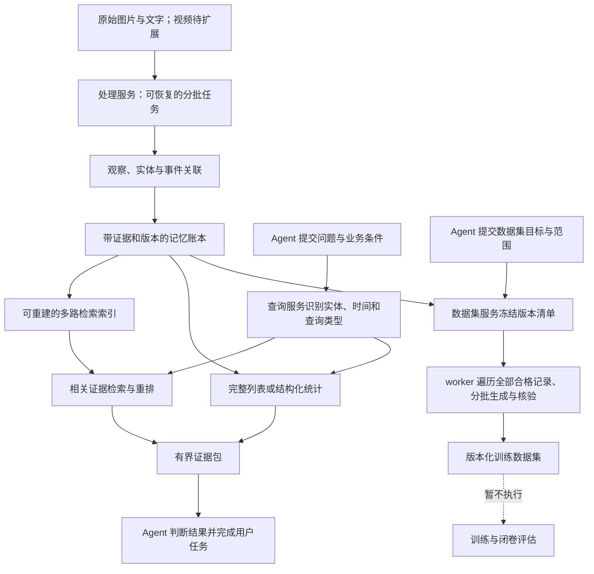

# 阶段十四：长期记忆组织、检索与训练数据基础

> 历史阶段记录：保留当时的决策、实测和限制。当前产品以 [产品定义](../product.md)、[架构](../architecture.md) 和 [Harness 重构计划](0018-harness-refactor.md) 为准。

状态：已完成。五项基础实施范围、验证及本地服务更新均已完成。用户暂不训练，本阶段未启动 Colab 或模型微调。真实日常素材质量、视频和参数记忆仍属于后续工作。

## 实施进度

| 项目 | 当前状态与证据 | 限制与后续工作 |
| --- | --- | --- |
| 独立服务与工具边界 | 新增 `MemoryQueryService`、`ModelAccess`、`MemoryProcessors`；Pi 接收业务工具工厂，通用 `AgentRuntime` 不再定义提取方法。查询服务可在不启动模型的情况下使用 | 随后续查询与数据结构扩展继续保持边界 |
| 批处理与结果反馈 | 新增 `AssetProcessingService`、`TaskJobs`，接入 `process_assets`、`read_job_result`、`manage_job`；完成通知通过 Pi 自定义消息继续任务。后台与浏览器验证覆盖无模型轮询、页面刷新后继续、重启续接、取消迟到结果、失败及读取范围；修正了停止等待后吞掉下一条请求的问题 | 随后续工具接入继续审查异常恢复和资源限制 |
| 读取正确性与规模 | 新增可重建的读取索引及 `MemoryCatalog`，去重、来源停用、人物/别名、冲突走索引；列表和人物游标绑定修订号，HTTP 与前端每次取最多 50 条。新版 1 万/10 万条基准已完成 | 人物计数、特征状态和精确去重的慢查询已修正；宽泛关键词与完整事件计数的限制见下表 |
| 实体、事件与混合检索 | 已实现 `MemoryGraph`、`MemoryFeatureService`、本地 ONNX worker、sqlite-vec 与 `query_events`；真实公开图片/中文语义对照及同名、未知、版本、合并拆分验证已运行；事件归组的浏览器验证通过 | 小样本不能替代日常相册与长尾问题评测 |
| 数据集与依赖 | 已实现 `DatasetService`、`DatasetLedger`、`build_dataset`、样本审核/导出与记忆备份恢复；验证 75 条中断续作、依赖失效和真实 Agent 调度 | 首版使用确定性模板；开放式改写、多样性和训练效果尚未验证 |

前三项先通过了 79 项后端测试和 30 项生产构建浏览器测试。全部接入后，97 项后端回归、仓库类型检查和隔离快照中的生产构建通过；32 项生产构建浏览器测试全部通过，用时约 2.2 分钟，新增验证包括所选记录构建/导出、刷新恢复、来源纠正后的样本及下载失效、事件合并和拆分。

全套后端测试限制为最多 4 个 worker，没有放宽原测试超时。最终验证曾与前端构建并行，发生磁盘等待及 26 项默认 5 秒超时；构建结束后单独运行 `pnpm test`，97 项全部通过，用时 56.32 秒。后续应分开执行构建与这组持久化集成测试。

外部模型在自动化测试中使用受控替身；另用实际配置的 `gpt-6-luna` 和一张有许可的公开咖啡照片运行 `pnpm --filter @memory/agent eval:harness:live`，验证了 Agent 提交处理工具、一次真实照片处理、一次完成通知、保存带来源的整理结果，以及观察保持草稿状态。该次隔离报告位于 `.data/evaluations/harness-live-BbrMh1/report.json`；这些检查验证调度和来源关联，不宣称视觉结论全部正确，这份早期照片报告没有验证之后加入的混合检索和数据集流水线。

对照原图后，仍发现该次视觉输出将杯子描述为圆盘/浅碗、将杯碟上的蓝白纹样描述为织物/垫子。未纠正这些输出来抬高本次成绩，原候选保持草稿。Harness 调度检查通过与视觉内容质量未通过分别记录；视觉处理器选型和核验属于后续工具服务工作。

2026-10-04（北京时间）已将验证后的版本更新到本地工作台 `http://localhost:3002`，后端为 `127.0.0.1:4310`。更新前检查没有活动任务，停服后创建一致性记忆备份，并另存私密设置、项目工作目录、检查点、日志及旧运行构建，保存在 `/home/dev/.local/state/digital-memory/backups/before-foundation-20261003T212206Z`。可重新下载的编码器缓存与隔离评测目录没有重复备份。随后在原目录重新完成生产构建并启动。

部署后检查确认 21 个工具已注册，CPU 检索处理器为 `ready`，数据集/人物/事件页面可打开且没有浏览器异常或失败请求。数据库迁移为 1—8，完整性检查通过、外键错误为零；模型连接和 Harness 配置的摘要与备份一致。原库的会话、素材及工作记录数量均为零，更新没有把评测材料填入用户资料库，真实模型版本也仍为零。记录位于 `.data/evaluations/harness-deployment.json` 和 `harness-production-smoke.json`。

## 混合检索、数据集与恢复验证

固定模型、部署方式、许可及细节见[本地处理方案](../local-memory-processing.md)。本地已部署 E5-small、SigLIP2 和 YuNet/SFace 的固定 ONNX 文件，推理无需 GPU。Node 服务只传任务所需文字/图片字节，不让主 Agent 操作向量或反复调度批次。

| 对照 | 实际结果 | 证据及边界 |
| --- | --- | --- |
| 12 条虚构中文经历 | FTS R@1/R@3 7/12；文本语义与修正后的融合均 12/12 | `hybrid-real-fdCU5o/report.json`；固定开发集，不能当作通用准确率 |
| 3 条中文图像查询 | Top-1 3/3 | 公开照片具有许可；不是用户经历 |
| 3 张公开肖像 | 每图一个对应区域，同人候选关联、不同人分开，身份全为未知 | 初版单尺度漏检保留，之后使用多尺度；不能证明日常人脸关联质量 |
| 有证据读取 | 实际 `gpt-6-luna` 6/6，包括两个未知问题 | 给定证据的读取，不是个人参数模型闭卷测试 |
| 全范围数据集 | 18 条输入全部处理；12 条虚构确认记录产生 24 个模板样本，6 条含未知信息的图像记录被排除 | `dataset-real-830vYA/report.json`，约 208 ms；种子的确认状态仅为评测设定 |
| 备份恢复 | 22 个文件、15,443,023 字节，ID/版本/观察/实体/事件/向量/样本一致；恢复后真实语义查询及纠正传播通过 | 同报告，私有配置与模型缓存另行管理；未训练 |
| 实际 Agent 调度 | 选择 event 类全部 12 条，提交一次、收到一次完成通知，保存数据集报告与链接 | 同报告；两次保存结果时误填 ID 被拒绝，后自行纠正，错误保留。已补清新建结果的工具参数说明 |

首次融合与读取报告 `hybrid-real-p3nOTt/report.json` 仍保留。改进包括降低普通文本问题的图像重复投票，明确虚构评测场景，以及未知题允许引用不足以回答的已给材料。修正后重新运行同一组题，具有开发集偏差。以上报告都位于 `.data/evaluations/`，原始内容与模型文件不进入 Git。

流水线的用户确认、策略待审、精确重复、75 条中断续作、限定资料范围、取消/失效、原件再次核验和备份文件改动使用独立集成测试验证。模型版本传播只用明确标记的测试注册元数据；没有创建、更新或声称训练过真实模型权重。

## 读取规模验证

脚本 `pnpm --filter @memory/agent bench:memory` 使用隔离目录，生成带确切 UTF-8 来源范围的虚构记录，不调用模型、不使用私人经历、不训练。报告包括 HTTP 处理与序列化、服务召回、工具调用及运行记录、分页、去重、纠正和停用；浏览器交互另行测试。以下第二轮测量发生在实体、事件及数据集接入前，保留作历史对照（毫秒）：

| 路径 | 1 万条 p50 / p95 | 10 万条 p50 / p95 |
| --- | --- | --- |
| 记忆总览 HTTP | 4.68 / 20.00 | 19.72 / 75.07 |
| 人物总览 HTTP | 5.72 / 7.02 | 9.57 / 10.55 |
| 连续分页 HTTP | 1.55 / 2.69 | 4.96 / 6.88 |
| 定向词项召回 | 0.63 / 6.48 | 0.55 / 6.06 |
| 人物及时间召回 | 1.07 / 1.84 | 1.28 / 2.17 |
| 宽泛词项召回 | 31.08 / 37.90 | 492.63 / 535.44 |
| 精确去重 | 0.16 / 0.75 | 0.14 / 0.83 |
| 工具调用及追踪（含创建、结束运行） | 47.32 / 67.49 | 81.14 / 125.40 |
| 增量纠正及索引写入 | 11.44 / 26.05 | 26.14 / 50.88 |

第二轮报告：`.data/evaluations/memory-scale-FZO9JY/report.json`。第一轮对照保留在 `.data/evaluations/memory-scale-3n7S4R/report.json`：十万条人物总览 p50 为 1,408.93 ms，去重 p50 为 22.72 ms。整改包括持久的增量人物计数/关联索引和先定位精确候选的查询计划。

第二轮进程峰值内存分别约 283 MiB / 302 MiB，包含服务、Pi SDK 和测试调用；观察到的堆增长约 42 / 49 MiB。数据库约 55 / 550 MiB，包含原陈述、版本、来源与派生索引；不包含原始文件。读取响应按 50 条限制：总览约 58 KB，人物总览约 143 KB；有界召回证据约 4.7 KB。记录规模扩大十倍没有导致全库 JSON 进入进程，但数据集形态和运行环境会影响结果，不能据此承诺任意资料库容量或延迟。

此后继续将状态计数维护在事务内的桶索引中，避免每次翻页重新计数全库，也避免内存缓存与事务回滚产生不一致；关键词列表先从 FTS 命中 ID 定位，十万条定向词项列表的独立读取审计 p50 约 0.31 ms。宽泛词项仍需对大量匹配项评分，本阶段不掩盖这一限制。合成数据只用于性能和完整性测试，不能证明语义召回、人物识别或参数记忆质量。

全部五项接入后的复测保存在 `.data/evaluations/memory-scale-Mg4hti/report.json`。首测发现索引状态扫描全部任务，使十万条总览 p50 增至 220.09 ms；事件列表重复筛选达到 2,648.17 ms。已将特征任务计数改为事务内增量维护，补队列及未知时间索引，并固定事件成员的查询路径。修正前报告保留为同目录 `report-before-counters.json`。修正后结果如下（毫秒）：

| 路径 | 1 万条 p50 / p95 | 10 万条 p50 / p95 |
| --- | --- | --- |
| 记忆总览 HTTP | 2.60 / 14.44 | 2.73 / 16.08 |
| 人物总览 HTTP | 5.80 / 7.04 | 5.29 / 7.84 |
| 连续分页 HTTP | 1.67 / 1.98 | 1.49 / 2.14 |
| 定向词项召回 | 0.75 / 5.67 | 0.82 / 7.10 |
| 人物及时间召回 | 1.42 / 1.99 | 2.64 / 3.75 |
| 宽泛词项召回 | 40.19 / 42.15 | 642.59 / 707.30 |
| 完整事件计数 HTTP | 27.71 / 39.66 | 611.35 / 708.46 |
| 事件列表 HTTP（含总数） | 30.03 / 31.06 | 596.88 / 610.94 |
| 精确去重 | 0.15 / 0.71 | 0.17 / 0.88 |
| 工具调用及追踪 | 28.87 / 31.25 | 41.08 / 53.47 |
| 增量纠正及索引写入 | 8.57 / 20.16 | 8.36 / 20.16 |

复测使用首测保留的数据库，包含之前 100 条纠正及停用/恢复操作的历史，没有重新生成完全相同的初始库。测量进程峰值内存约 325 / 312 MiB，堆增长约 32 / 39 MiB；数据库约 81 / 809 MiB，新增观察、关系和依赖结构会增加存储。总览响应约 60 KB、人物总览约 145 KB，均保持有界。此规模测试未配置编码器，只测结构化/关键词路径与维护开销，不代表十万向量的速度。宽泛词项评分和完整事件总数仍随匹配范围增长，约 600 ms 的限制留作后续优化依据；没有以 Top-K 计数替代完整统计。

## 问题与现状

资料量增长后，Agent 无法把全部图片、经历和人物关系放入上下文。长期保存、找到正确证据、完成复杂推理、形成可训练样本是不同问题。本阶段开始时，照片实现只验证了图片请求、观察入库和核对后的关键词召回；该结果不足以作为整个系统的验收。

已实现的持久层包括 `.data/assets/<assetId>` 原件、SQLite 中的来源/记忆及版本、处理任务与 Pi 会话文件。关闭会话、切换供应商不会把这些文件变成模型参数，也不会自动删除它们。本阶段补充了一致性备份、恢复演练和迁移核验，后续仍需维护定期备份；不能承诺“存入数据库就永久不会丢”。

实施前代码审计发现以下问题，整改状态以上方进度表为准：

| 位置 | 整改前行为 | 影响 |
| --- | --- | --- |
| `memory-routes.ts` 的 memory-overview | 全量读取、反序列化并返回记忆，随后计算人物与冲突 | 前端显示分页不等于服务端分页，资料增长后响应和内存一起增长 |
| `workspace-store.ts` 的 duplicateMemory | 每个候选读取全部记忆并逐条判断 | 大批增量导入的去重成本不断增加 |
| `workspace-tools.ts` 的 search_memories | 索引检索后又全量查找草稿及其冲突 | 检索 SQL 快不等于整个 Agent 工具调用快 |
| `workspace-store.ts` 的 searchMemories | 先取有限候选，再过滤关联来源停用 | 被停用来源占满候选时，后面的有效记录可能漏检 |
| `memory-retrieval.ts` 的 memoryContext | 保留类型、版本和定位，但未传递单独的 uncertainty 字段 | 保存的不确定性没有完整进入模型的读取材料 |
| `photo-extraction.ts` / `photoCandidates` | 输出描述与可选区域，照片人物和发生时间留空 | 还不能把多张照片组织成同一人物或一次经历 |
| 业务工具与存储模型 | 已有独立导入队列，但缺少 Agent 提交接口；提取方法仍挂在 AgentRuntime，未建立样本/数据集依赖账本 | 工具、处理服务和主 Agent 的职责尚未分清，难以独立扩展和验证 |

已有一万条检索评测主要是十个定向问题和重复形式的干扰记录，测量路径没有覆盖上述全部开销。其结果不能证明自然语言语义召回、多跳问题、视觉识别或十万条以上端到端性能。

## 先确定 Agent、Harness 与业务服务的边界

Agent 的职责是协助用户完成任务：理解目标、选择工具、利用返回结果继续判断并交付。检索、存储和处理基础设施需要单独开发、测试和维护；批量工作不依赖 Agent 在每一步发出指令。Harness 的总体职责见[架构设计](../architecture.md#harness-的职责与工具边界)。

| 层 | 本阶段职责 |
| --- | --- |
| Agent | 决定需要查找、整理或生成什么；组合业务结果；处理需要判断的歧义 |
| Harness | 提供 Pi 工具循环、执行环境、上下文预算和权限；保存调用与作业关联；接收完成事件并按任务状态继续 |
| 工具适配层 | 将类型化业务请求交给服务，注入服务端确认的资料范围和调用身份，返回结果或作业引用 |
| 业务服务及 worker | 执行检索、预处理、专用模型调用、去重、持久化、索引维护、分批核验及恢复 |

先复用已有 `search_memories` 工具和 `MemoryImports` 服务。检索服务应能脱离 Pi 会话接受查询并返回有界证据；素材处理服务应能在没有主 Agent 运行的情况下继续已提交作业。它们可以继续在当前后端进程内运行，无需先引入微服务框架。

业务接口及当前实施边界如下：

| 能力入口 | Agent 提交 | 服务返回及内部责任 |
| --- | --- | --- |
| `search_memories`（已拆分服务） | 问题、人物/时间等有意义的条件 | 证据、来源版本、冲突与覆盖情况；服务负责查询解析、召回、过滤与排序 |
| `process_assets`（已接入） | 已选素材或范围引用、整理目标 | 作业 ID、状态与结果引用；worker 负责预处理、提取、去重、保存和索引更新 |
| `query_events`（已接入） | 列表或统计目的、人物和时间范围 | 聚合结果或分页结果、处理覆盖率；不能把 Top-K 当全集 |
| `build_dataset`（已接入） | 已授权范围、样本用途与策略 | 作业 ID、版本清单、核验报告及待处理问题；worker 遍历、生成、核验并持久保存，不启动训练 |

工具不暴露每个底层处理步骤供模型反复安排。编码器、排序策略、重试和批次大小由服务配置；需要专用模型时由服务内部调用。用户纠正与新增素材引发的维护作业由服务端触发。主 Agent 只在结果对当前用户任务有意义时继续运行。

异步调用先保存受理回执并返回作业 ID。进度通过后端事件更新 WebUI，完成事件按任务状态和事件 ID 触发一次后续处理，模型不循环查询进度。任务暂停、取消、重启和作业失败须有明确状态；失败不应被自动改写成成功或频繁转成用户确认问题。

## 持久对象与标识

沿用现有 Store、MemoryEntry、MemoryEvidence 和版本机制，通过迁移扩展；不另建一套相互冲突的个人记忆真源。以下是当前建立的稳定标识和依赖关系。独立派生素材父子关系、视频时间定位及人物角色图谱待扩展，真实训练模型版本仍为空。

| 对象 | 稳定标识和关联 | 保存内容 |
| --- | --- | --- |
| 原始素材 Asset | assetId、内容摘要；预览另存摘要和定位 | 原件、来源、导入时间；本地提取拍摄时间/时区及 GPS 存在标记，保留依据和未知值 |
| 观察 Observation | observationId → 素材/消息来源 + 区域/原文范围 | 原始处理输出、处理器及版本、观察类型、不确定性；核对与纠正关联到记忆和关系版本 |
| 人物身份与候选 Entity | 稳定 personId/entityId；观察通过关系表引用 | 已确认姓名/别名、未知身份、身份依据；候选实体、特征版本与真实身份分别保存 |
| 事件 Event | eventId → 记忆版本 → 人物/观察来源 | 事件归组、合并拆分和修订；时间、地点和人物沿成员记忆读取，一件事可有多份素材 |
| 记忆 Memory | 现有 memoryId + version → 实体/事件/证据 | 可用的陈述、观察与推断、有效时间、纠正与替代关系 |
| 索引 Index | 对象 ID + 对象版本 + 编码器版本 | 关键词、文本/图像向量、人物特征和结构化索引；均可从原件和账本重建 |
| 样本及数据集 | sampleId → memoryId@version/证据；datasetId → 样本清单 | 问答或叙述样本、生成及核验记录、排除原因和模型版本依赖；当前固定训练用途，尚未划分评测集 |

文件摘要解决原件一致性和精确重复问题，不解决“照片里是不是同一个人”。普通图像语义向量也不能直接当作可靠身份标识。人物关联应从出现区域和专用特征建立候选簇，有可靠身份依据后关联稳定 personId；对可靠的重复出现减少重复核对，对不确定和冲突的关联保留待确认。簇合并/拆分、编码器更换不能静默改写历史身份。

现有发送副本移除 EXIF/GPS 的行为继续保留。原始元数据在本地单独解析，拍摄时间与导入时间分开；EXIF 也可能错误，不能直接当成用户确认的事实。地理信息是否进入外部请求由执行边界决定。

## 三条读取路径

以下是三条业务路径的设计要求。当前查询解析以已确认姓名/别名和显式结构化条件为主，不声称能解析任意口语时间、社会关系或地理范围。

### 相关事实问答

步骤 1—4 属于检索服务内部。Agent 提交业务问题与已知条件，无需选择索引、融合算法或逐条检查数据库版本。

1. 解析问题涉及的人物、时间、事件、历史/当前状态以及隐私范围。姓名先通过别名和可靠身份关联解析为稳定 ID；无法唯一解析时保留歧义。
2. 并行召回关键词候选、文本语义候选、原始图像/区域候选和实体/事件邻接证据。时间、空间和停用条件尽可能在索引层生效。各路相似度含义不同，不直接相加当作置信度。
3. 合并和重排候选，从账本重新读取当前版本，检查替代、冲突、来源停用和不确定性。向量索引更新延迟时，旧版本不能进入有效证据；过滤后不足可继续有界补取。
4. 给 Agent 带来源的证据包，保留版本、有效时间、观察/推断类型、不确定性和截断/覆盖范围。优先按 token 与延迟预算控制，不能只按固定条数判断信息是否足够。
5. Agent 可以针对缺少的子问题追加查询，或按明确来源查看原文/图片区域。轮次、读取范围、外部请求与资源限额由服务端控制；停止条件是证据充分或预算耗尽，耗尽须明确说明未解决部分。

例如“去年和小张去过哪些地方”，查询服务应先解析小张的 personId，再按时间筛选有关事件，合并事件中的照片和文字依据，区分已确认地点与推断地点。无法唯一解析人物时返回候选和歧义，供 Agent 利用任务上下文处理；不能只靠标题命中“小张”便认为查询完整。

### 完整列表与统计

“去年一共旅行几次”“列出所有与某人有关的事件”需要完整性。查询服务在结构化条件可覆盖时直接查询事件表、去重和聚合，再分页提供可核对来源；只有部分素材经过处理时报告覆盖范围。较长的分批聚合由作业执行器保存进度，Agent 根据返回结果进行用户需要的分析，相关性 Top-K 不能冒充总数或全集。

### 训练数据构建

数据集构建服务接收范围和策略后，从冻结的记忆版本清单读取，按游标遍历所有符合策略的记录，记录成功、失败、排除及待核对数量。处理批次和进度在数据库中持久保存；上下文清空或进程重启后依据回执继续。Agent 接收进度摘要、核验结果和需要判断的问题，无需记住每批处理过什么。

每个样本必须关联确切记忆版本与原始证据。生成改写问答、组合问题和叙述之后，分别检查事实依据、人物、日期、冲突和重复；模型生成结果及另一个模型的赞同均不能自动充当事实证明。不能只训练经常被查询到的内容，也不能把整份聊天记录直接当作干净训练集。

纠正传播链为：来源/实体关联修订 → 受影响记忆版本 → 检索索引 → 样本 → 数据集 → 模型版本。已有模型权重不会因数据库改正而自动修正；先标记受影响版本，后续通过重新训练或经过独立验证的更新方式处理。

参数记忆评估区分两类：已学习事实采用未出现过的问法和组合题检查记忆；完全未学习的私人事实用于检查拒答，不能要求闭卷模型正确回忆。不能将同一问题的近似改写随机拆到训练/测试集后宣称泛化。还需检查新批次训练后的旧知识保持、时间变化及错误修订。

## 实施次序与验收

1. **先做通一个工具与独立服务的完整调用。** 从现有 `search_memories` 提取业务查询服务，Pi 适配层只保留范围、权限和调用记录；将专用提取接口与通用 `AgentRuntime` 分开。在不启动主 Agent 的情况下验证服务，并验证 Agent 能正确调用和利用真实结果。上下文装配通过受控服务接口获取证据，不在 Pi 内核适配中维护业务查询策略。
2. **打通批处理作业的提交与结果反馈。** 复用 `MemoryImports` 接入指定素材处理工具；补作业与用户任务的关联、状态事件及完成后续接。验证重复提交不重复保存、断线后继续、取消后不误续接、失败如实呈现，以及等待时不靠模型轮询。照片识别质量与 Harness 调度正确性分别验收。
3. **解决现有扩展性和读取正确性。** 记忆列表改服务端游标分页；精确去重、实体关联和冲突通过索引定位；停用在候选截断前生效或完整补取；证据包保留不确定性。分别记录 1 万/10 万条条件下整条请求的耗时、峰值内存、响应体积与索引维护时间，合成数据仅用于性能测试。
4. **在服务内部建立实体、事件与混合检索。** 补稳定观察 ID、来源定位、实体/事件关系及版本失效机制。用同名不同人、跨照片关联、未知身份、日期不确定、合并拆分和来源修改验证。比较 FTS、语义及组合检索的证据召回、身份/时间正确性、旧值污染、未知拒答、总数完整性、上下文占用和延迟；真实识别使用明确许可的素材与独立核对。
5. **独立完成数据集构建的无训练验证，再接工具入口。** 从固定版本清单全量导出、生成、核验和统计，演练中断续作、纠正后的失效传播，以及备份恢复后 ID/版本/证据一致。Agent 验收关注范围选择和结果处理，流水线验收关注覆盖与正确性。训练仍维持暂停安排。

存储第一步继续使用本地文件与 SQLite，先把真源结构和访问路径理顺。全文索引、关系查询、语义索引分别通过适配层访问，不能仅为使用某个框架就整体重做 Pi Harness、人物体系或前端。引入独立向量/图服务要有实际规模、过滤、更新和维护成本的测量依据。

## Exa 检索到的参考及使用边界

- [LongMemEval 论文](https://arxiv.org/abs/2410.10813)与[作者代码](https://github.com/xiaowu0162/LongMemEval)：将索引、检索和读取分开分析；评测涵盖多会话、时间、更新和拒答。用于组织评测类别，不把本项目的小样本结果称为该基准成绩。
- [LongMemEval-V2 论文](https://arxiv.org/html/2605.12493v1)与[作者仓库](https://github.com/xiaowu0162/LongMemEval-V2)：针对长篇 Agent 轨迹，由记忆系统先获取紧凑证据，再评估回答准确性及查询延迟，并比较检索与文件取证方法。其任务是环境和工作流经验，不能直接替代个人相册或参数记忆测试。
- [Qdrant 官方多阶段检索文档](https://qdrant.tech/documentation/search/hybrid-queries/)：提供多路预取与排序融合的接口参考。本项目尚未部署 Qdrant，是否引入由对照测试决定。
- [Qwen3-VL-Embedding-2B 官方模型卡](https://huggingface.co/Qwen/Qwen3-VL-Embedding-2B/blob/main/README.md)：提供图文共同检索及配套重排模型的候选方向。尚未下载、部署或在本机验证；检索嵌入不是个人参数记忆，模型卡分数不等于个人资料上的质量。
- [Graphiti 官方概览](https://help.getzep.com/graphiti/getting-started/overview.mdx)与[来源事件说明](https://help.getzep.com/graphiti/core-concepts/adding-episodes.mdx)：参考时间关系、增量来源关联与查询方式。本项目事件/身份由本地账本掌握，不直接把框架自动抽取的关系视作确认事实。

以上为搜索到的原始论文或维护方资料。分层、接口与验收顺序是针对本项目现状的设计判断；外部资料不能作为本项目的实现或效果证明，实际进度以上面的验证记录为准。
